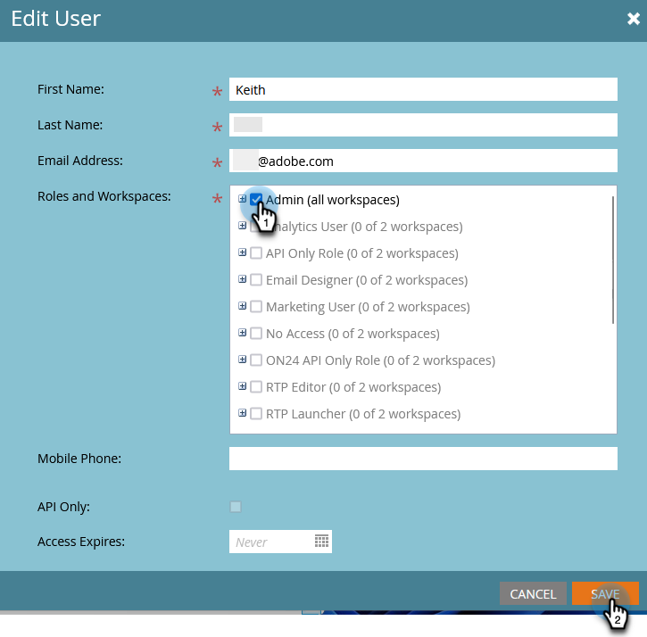

# Skapa, ta bort, redigera och ändra en användarroll {#create-delete-edit-and-change-a-user-role}

**Roller** gruppera en mängd behörigheter. **Behörigheter** gör att du kan göra saker i Marketo. Du tilldelar en **roll** till en användare. Enkelt som paj.

>[!NOTE]
>
>**Administratörsbehörigheter krävs**

>[!IMPORTANT]
>
>Följande roller är systemroller och kan inte redigeras eller tas bort:
>
>* Administratör
>* Adobe produktadministratör
>* Standardanvändare
>* RTP-redigerare
>* RTP-startprogram

## Skapa en roll {#create-a-role}

1. Gå till **[!UICONTROL Admin]** område.

   

1. Klicka på **[!UICONTROL Users & Roles]**.

   

1. Gå till **[!UICONTROL Roles]** och klicka **[!UICONTROL New Role]**.

   

1. Namnge din nya roll, kontrollera alla behörigheter du vill ge användare som är kopplade till rollen och klicka på **[!UICONTROL Create]**.

   

## Ta bort en roll {#delete-a-role}

1. Gå till **[!UICONTROL Admin]** område.

   

1. Klicka på **[!UICONTROL Users & Roles]**.

   

1. Under **[!UICONTROL Roles]** väljer du en roll och klickar på **[!UICONTROL Delete Role]**.

   

1. Bekräfta borttagningen genom att klicka **[!UICONTROL Delete]**.

   

>[!NOTE]
>
>Du måste först se till att inga användare är tilldelade till en roll, annars kan den inte tas bort.

## Redigera en befintlig roll {#edit-an-existing-role}

>[!NOTE]
>
>Om du vill redigera din egen användarroll måste du logga in som en annan användare med administratörsbehörighet.

1. Gå till **[!UICONTROL Admin]** område.

   

1. Klicka på **[!UICONTROL Users & Roles]**.

   

1. Klicka på **[!UICONTROL Roles]** -fliken.

   

1. Markera den roll du vill redigera och klicka på **[!UICONTROL Edit Role]**.

   

1. Gör alla ändringar du behöver och klicka **[!UICONTROL Save]**.

   

   >[!NOTE]
   >
   >Ändringarna som görs i rollen påverkar alla användare som är kopplade till den här rollen.

   >[!TIP]
   >
   >Vill du uppdatera kontots e-postadress? [Läs mer här](/help/marketo/product-docs/administration/settings/edit-account-settings.md).

## Ändra en användares roll {#change-a-users-role}

1. Gå till **[!UICONTROL Admin]** område.

   

1. Klicka på **[!UICONTROL Users & Roles]**.

   

1. Välj den användare som du vill tilldela en annan roll till och klicka på **[!UICONTROL Edit User]**.

   

1. Avmarkera föregående roll, markera den nya och klicka sedan på **[!UICONTROL Save]**.

   

>[!NOTE]
>
>Om du låter flera roller vara markerade får Marketo den mest restriktiva behörigheten som standard.
