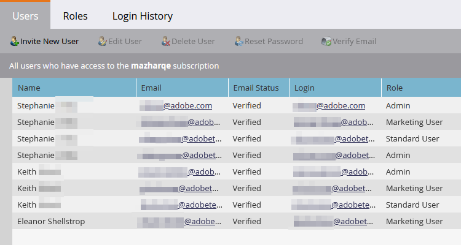

# E-postverifiering {#email-verification}

Prenumerationer på Adobe Marketo Engage kräver att alla användare som inte är API bara verifierar sin e-postadress. Användare med enkel inloggning (SSO) får automatiskt sin e-post verifierad när deras prenumeration är aktiverad med e-postverifiering.

**Användarinbjudan**

När en administratör bjuder in en användare verifieras den användaren automatiskt när han/hon klickar på länken för inbjudan. Användare med enkel inloggning verifieras automatiskt.

**Ändra en e-postadress**

När en användares e-postadress ändras blir den inte verifierad. Ett e-postmeddelande skickas till dem där de kan verifiera igen. Administratörer kan skicka om e-postmeddelandet manuellt genom att klicka på **Skicka verifiering igen**.

**Användare och roller**

I kolumnen Admin > Användare &amp; roller visas verifieringsstatusen för varje användare i kolumnen E-poststatus.

Om du vill verifiera en overifierad användare markerar du användarens post och klickar på knappen **Verifiera e-post** -knappen.
