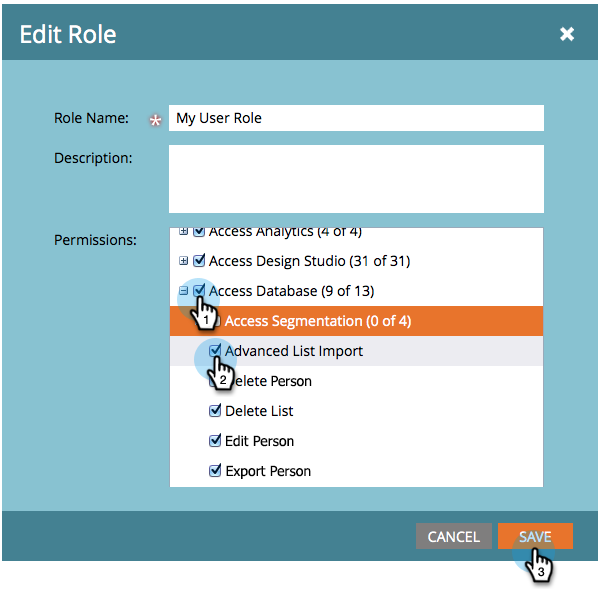

# Aktivera importeringsbehörighet för avancerad lista för en roll {#enable-the-advanced-list-import-permission-on-a-role}

Listimportläget är endast tillgängligt för användare med en roll där behörigheten Avancerad listimport är aktiverad. Alla andra användare ser inte listrutan Listimportläge när de importerar en lista med personer och alla listor som de importerar som standard använder normalt importläge.

>[!NOTE]
>
>**Administratörsbehörigheter krävs**

1. Gå till **Admin**.

   

1. Klicka på **Användare och roller**.

   

1. Under fliken **Roller **väljer du den roll du vill ändra och klickar på **Redigera roll**.

   

1. Under Access Database (Åtkomstdatabas) markerar du **Advanced List Import** (Avancerad listimport) och klickar sedan på **Save**(Spara).

   

Häftig! Nu har alla användare som är associerade med den roll du redigerade avancerade alternativ för listimport aktiverat.
