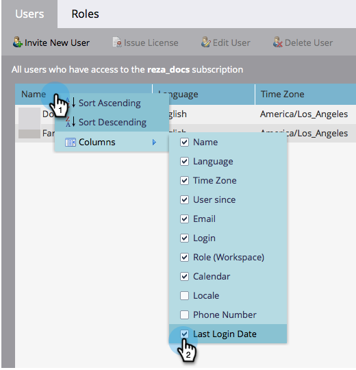

# Exportera en lista med användare och roller {#export-a-list-of-users-and-roles}

>[!NOTE]
>
>**Administratörsbehörigheter krävs**

Det är ganska enkelt att exportera en fullständig lista över användare och användarroller. Så här gör du.

1. Gå till **Administratör**.

   

1. Klicka **Användare och roller**.

   

1. Lägg till/ta bort kolumner som du vill ha innan du exporterar.

   >[!TIP]
   >
   >Om du vill exportera roller går du till **Roller** först och sedan exportera.

   

1. Klicka på **Exportera** ikon.

   

   Och det där är alla! Du bör hämta den nya Excel-filen.

   
