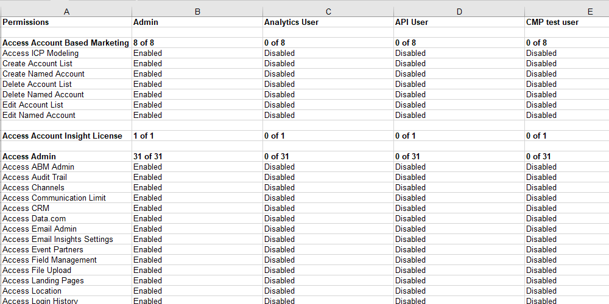

# Exportera roller och behörigheter {#export-roles-and-permissions}

Så här exporterar du alla roller och deras behörigheter.

>[!NOTE]
>
>Administratörsbehörigheter krävs

1. Klicka på **Admin** på My Marketo.

   

1. Välj **Användare och roller**.

   

1. Klicka på fliken **Roller**.

   

1. Rulla längst ned på sidan och klicka på knappen Exportera.

   

>[!NOTE]
>
>Kontrollera att webbläsaren inte blockerar popup-fönster från Marketo.

Data exporteras som en CSV-fil och innehåller roller, behörigheter och antal behörigheter som har aktiverats per grupp.

