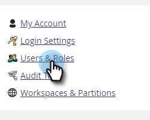

# Hantera Marketo-användare {#managing-marketo-users}

>[!IMPORTANT]
>
>Den här artikeln är endast avsedd för dem som _inte_ använder [Marketo med Adobe-identitet](/help/marketo/product-docs/administration/marketo-with-adobe-identity/adobe-identity-management-overview.md){target="_blank"}. Om du gör det följer du stegen i [den här artikeln](/help/marketo/product-docs/administration/marketo-with-adobe-identity/add-or-remove-a-user.md){target="_blank"}.

## Skapa användare {#create-users}

1. Gå till området **[!UICONTROL Admin]**.

   

1. Klicka på **[!UICONTROL Users & Roles]**.

   

1. Klicka på **[!UICONTROL Invite New User]**.

   

1. Ange **[!UICONTROL Email]**, **[!UICONTROL First Name]** och **[!UICONTROL Last Name]**.

   

1. Du kan också ange en orsak till inbjudan och välja ett förfallodatum i fältet **[!UICONTROL Access Expires]** med datumväljaren.

   

1. Klicka på **[!UICONTROL Next]**.

   

   >[!TIP]
   >
   >Ett förfallodatum passar bra för kortsiktiga externa intressenter eller konsulter som bara behöver tillgång till Marketo under en kort tid.

   >[!NOTE]
   >
   >När förfallodatumet inkommer får användaren ett meddelande om förfallodatum och kontot är låst.

1. Välj **[!UICONTROL Role]** och klicka på **[!UICONTROL Next]**.

   

1. Redigera inbjudningsmeddelandet om det behövs. Klicka på **Send**.

   

   >[!NOTE]
   >
   >E-postadressen/inloggningen måste vara unik. Om du redan har använt den i en sandlådeinstans måste du använda en annan i produktionen och vice versa.

   

   >[!NOTE]
   >
   >Inbjudningarna går ut tre dagar efter att en ny användare har lagts till.

Den nya användaren visas nu på fliken Användare och får ett e-postmeddelande med instruktioner om hur du aktiverar kontot.

## Ta bort användare {#delete-users}

>[!NOTE]
>
>Om användaren som du vill ta bort även är en Dynamic Chat-användare måste du [ta bort dem från Dynamic Chat](/help/marketo/product-docs/demand-generation/dynamic-chat/setup-and-configuration/add-or-remove-chat-users.md#remove-a-chat-user){target="_blank"} i Admin Console innan du kan ta bort dem i Marketo Engage.

1. Gå till området **[!UICONTROL Admin]**.

   

1. Klicka på **[!UICONTROL Users & Roles]**.

   

1. Markera den användare som du vill ta bort och klicka på **[!UICONTROL Delete User]**.

   

1. Bekräfta genom att klicka på **[!UICONTROL OK]**.

   

## Återställ användarlösenord {#reset-user-passwords}

1. Gå till området **[!UICONTROL Admin]**.

   

1. Klicka på **[!UICONTROL Users & Roles]**.

   

1. Markera en användare och klicka på **[!UICONTROL Reset Password]**.

   

1. Klicka på **[!UICONTROL Close]** om du vill stänga uppmaningen.

   

Användaren får ett e-postmeddelande med instruktioner för lösenordsåterställning.

>[!TIP]
>
>Om användaren inte ser e-postmeddelandet i sin inkorg ber du dem att kontrollera skräppostmappen.

## Ändra behörigheter och redigera användarinformation {#change-permissions-and-edit-user-information}

1. Gå till området **[!UICONTROL Admin]**.

   

1. Klicka på **[!UICONTROL Users & Roles]**.

   

1. Markera en användare och klicka på **[!UICONTROL Edit User]**.

   

1. Du kan redigera användarinformation och ändra den associerade rollen. Klicka på **[!UICONTROL Save]**.

   

>[!CAUTION]
>
>Om du är den enda administratören i Marketo ska du inte ta bort dina egna administratörsrättigheter.

>[!NOTE]
>
>Om en ny användare är inbjuden som administratör, eller om en administratör tas bort, får alla aktuella administratörer ett e-postmeddelande.

Fantastiskt arbete! Nu vet du hur du skapar en användare, tar bort en användare, återställer användarens lösenord och redigerar användare.
