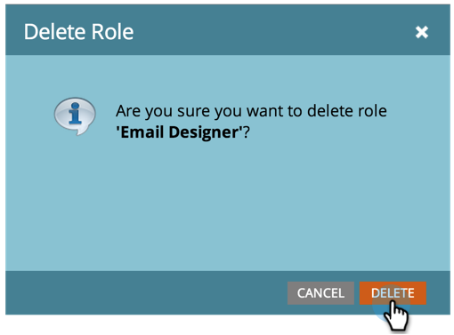

# Hantera användarroller och behörigheter {#managing-user-roles-and-permissions}

Ange, skapa och redigera användarroller och tilldela dem till användare. På så sätt kan du styra vilka områden och funktioner som varje Marketo-användare har tillgång till.

En marknadsföringsanvändare behöver till exempel vanligtvis bred åtkomst i hela programmet för att kunna skapa, ändra och distribuera e-post, landningssidor och program. En webbdesigner däremot spenderar nästan hela sin tid på Design Studio och skapar material för e-post och landningssidor. Och även om företagsledare i stor utsträckning använder sig av Marketos rapporter i Analytics-området kanske de inte behöver skapa eller driva tillgångarna eller programmen själva.

>[!NOTE]
>
>**Administratörsbehörigheter krävs**

Marketo har flera inbyggda roller med olika åtkomstnivåer:

* **Admin **- Alla delar av programmet, inklusive avsnittet Admin
* **Standardanvändare **- alla delar av programmet, utom administrationsavsnittet
* **Marknadsföringsanvändare** - alla delar av programmet, utom avsnittet Admin
* **Web Designer **- endast Design Studio
* **Analytics User **- only the Analytics section

Du kan inte redigera rollerna Admin och Standard User, men du kan redigera de andra. Du kan också skapa nya anpassade roller som matchar de särskilda organisationsstrukturerna i ditt företag.

## Tilldela roller till en användare {#assign-roles-to-a-user}

Du kan tilldela roller till en användare när du [skapar användare för första gången](http://docs.marketo.com/display/DOCS/Create%2C+Delete%2C+Edit+and+Change+a+User+Role) eller genom att [redigera en befintlig användare](managing-marketo-users.md).

1. Om du vill redigera en befintlig användare går du till **Admin** och klickar på **Användare och roller**.

   

1. I listan väljer du den användare som du vill redigera och klickar på **Redigera användare**.

   

1. Under **Roller** väljer du de roller du vill tilldela användaren, baserat på de behörigheter användaren behöver, och klickar sedan på **Spara**.

   

   >[!NOTE]
   >
   >Mer information om de olika rollerna finns i [Beskrivningar av rollbehörigheter](managing-user-roles-and-permissions/descriptions-of-role-permissions.md).

## Skapa en ny roll {#create-a-new-role}

Ibland har din organisation mycket specifika medarbetare som kräver en anpassad kombination av behörigheter.

1. Om du vill skapa en ny användarroll går du till Admin och klickar på Användare och roller.

   

1. Klicka på fliken Roller.

   

1. Klicka på Ny roll.

   

1. Ange ett rollnamn, en beskrivning (valfritt) och välj de behörigheter som användare i den här rollen behöver.

   

## Redigera en roll {#edit-a-role}

Om du behöver ändra behörigheterna som är kopplade till en befintlig roll kan du redigera rollen.

1. Gå till **Admin** och klicka på **Användare och roller**.

   

1. Klicka på fliken **Roller **.

   

1. Välj den roll du vill ändra i listan och klicka på **Redigera roll**.

   

1. Ändra **rollnamn** och **Beskrivning **om det behövs, och ändra sedan urvalet av associerade **behörigheter**.

   

   >[!NOTE]
   >
   >Användare som har den roll du har redigerat får de ändrade behörigheterna när de har loggat ut och loggat in igen.

## Ta bort en roll {#delete-a-role}

Om en roll blir onödig kan du ta bort den.

1. Gå till Admin och klicka på Användare och roller.

   

1. Klicka på fliken Roller.

   

1. I listan markerar du den roll du vill ta bort och klickar på Ta bort roll.

   

1. Bekräfta genom att klicka på Ta bort.

   

>[!MORELIKETHIS]
>
>Läs mer om hur du skapar ytterligare användare och tilldelar dem roller i [Komma igång med Marketo](../../../getting-started.md).

>[!NOTE]
>
>**Djupdykning**
>
>Lär dig mer om andra administrativa uppgifter i [Admin](http://docs.marketo.com/display/docs/administration) Devices.
