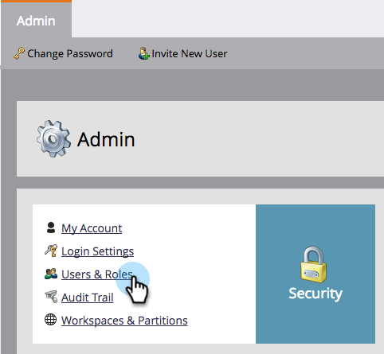

# Aktivera No-draft för kodfragment {#enable-no-draft-for-snippets}

Med No-Draft for Snippets kan du distribuera kodfragmentändringar utan att skriva ut godkända resurser. Alla resurser som använder det redigerade fragmentet får uppdateringarna och behåller sina respektive statusvärden:

* Godkända resurser får fragmentuppdateringarna och förblir godkända

* Utkast hämtar fragmentuppdateringarna och behåller utkastläget

Inget utkast aktiveras automatiskt för alla administratörsroller. En administratör kan sedan aktivera den här funktionen för ytterligare roller.

>[!NOTE]
>
>**Administratörsbehörigheter krävs**

1. Gå till **Admin** och klicka på **Användare och roller**.

   

1. Gå till fliken **Roller** , markera en roll och klicka sedan på **Redigera roll**.

   

1. Expandera alternativet **Access Design Studio** .

   

1. Expandera alternativet **Åtkomstfragment** .

   

1. Expandera behörigheten **Godkänn fragment** och markera rutan **Ej utkast** . Klicka sedan på **Spara**.

   

>[!TIP]
>
>Om du vill inaktivera No-Draft följer du steg 1-4 ovan, avmarkerar kryssrutan No-Draft och klickar på **Save**.

>[!MORELIKETHIS]
>
>[Godkänn ett kodfragment utan utkast](../../../../product-docs/personalization/segmentation-and-snippets/snippets/approve-a-snippet-with-no-draft.md)

