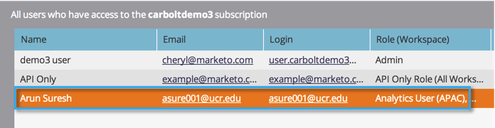

# Tillåt användaråtkomst till en arbetsyta {#allow-user-access-to-a-workspace}

Arbetsytor kan vara av vilken anledning som helst (t.ex. affärsenhet eller geografisk separation). De separerar resurserna (smarta listor, program osv.) för varje team. Så här ger du en användare åtkomst till en eller flera arbetsytor.

>[!NOTE]
>
>**Administratörsbehörigheter krävs**

>[!NOTE]
>
>Läs mer om [arbetsytor](/help/marketo/product-docs/administration/workspaces-and-person-partitions/understanding-workspaces-and-person-partitions.md).

1. Klicka på Användare och roller under Administratör.

1. Under fliken **Användare** markerar du användaren och klickar på **Redigera användare**.

   

1. Välj den **roll och arbetsyta** som du vill att användaren ska ha tillgång till.

   >[!NOTE]
   >
   >Du kan tillåta användarna att ha valfri kombination av åtkomst till arbetsytor.

   

1. När du har sparat ändringarna bör du se uppdateringen!

   

Bra! När de loggar in ser de alla arbetsytor du gett dem åtkomst till.
