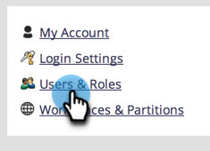

# Tillåt användaråtkomst till en arbetsyta {#allow-user-access-to-a-workspace}

Arbetsytor kan vara av vilken anledning som helst (t.ex. affärsenhet eller geografisk separation). De separerar resurserna (smarta listor, program osv.) för varje team. Så här ger du en användare åtkomst till en eller flera arbetsytor.

>[!NOTE]
>
>**Administratörsbehörigheter krävs**

>[!NOTE]
>
>Läs mer om [arbetsytor](/help/marketo/product-docs/administration/workspaces-and-person-partitions/understanding-workspaces-and-person-partitions.md).

1. Gå till **Administratör** område.

   

1. Klicka **Användare och roller**.

   

1. Under **Användare** markerar du användaren och klickar på **Redigera användare**.

   

1. Välj **Roll och arbetsyta** du vill att användaren ska ha tillgång till.

   

   >[!NOTE]
   >
   >Du kan tillåta användarna att ha valfri kombination av åtkomst till arbetsytor.

När du har sparat ändringarna bör du se uppdateringen.

