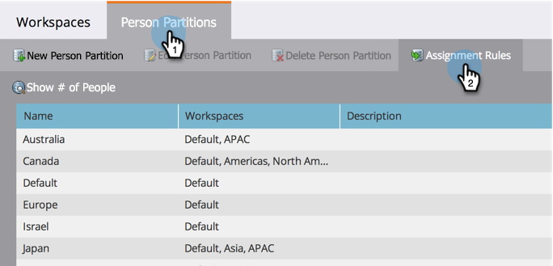

# Tilldela personpartitioner med tilldelningsregler {#assigning-person-partitions-with-assignment-rules}

>[!NOTE]
>
>**FYI**
>
>Marketo standardiserar nu språk för alla prenumerationer, så du kan se lead/leads i din prenumeration och person/personer på docs.marketo.com. Dessa termer betyder samma sak. det påverkar inte artikelinstruktionerna. Det finns andra förändringar också. [Läs mer](http://docs.marketo.com/display/DOCS/Updates+to+Marketo+Terminology).

>[!NOTE]
>
>**Administratörsbehörigheter krävs**

>[!NOTE]
>
>**Förutsättningar**
>
>* [Skapa en personpartition](create-a-person-partition.md)

>

När du använder personpartitioner ska du ställa in tilldelningsregler för att dirigera personer som skapats från CRM till sina respektive partitioner.

>[!NOTE]
>
>Endast personer som har skapats i Marketo från din CRM och via SOAP API kommer att ha tilldelningsregler tillämpade på dem.

1. Klicka på Arbetsytor och partitioner under Admin.

1. Under fliken **Personpartitioner **klickar du på **Uppdragsregler**.

   

1. Klicka på **Add Choice **för att lägga till villkor för att dirigera personer till personpartitioner.

   

1. Markera fältet som villkoret ska byggas på.

   

1. Välj önskad operator och ange ett värde.
1. 

1. Markera den personpartition som du vill att de personer som uppfyller villkoren ska ingå i.

   

   >[!NOTE]
   >
   >
   >Du kan lägga till så många alternativ du vill.

   Klicka på Spara.
   

Och där har du den! Du har tilldelat regler för att fylla dina personpartitioner med personer!

>[!NOTE]
>
>Standardalternativet används om inget av de föregående villkoren uppfylls.

