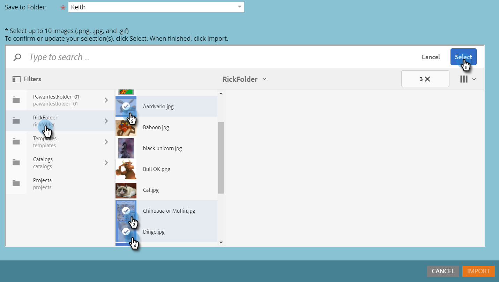
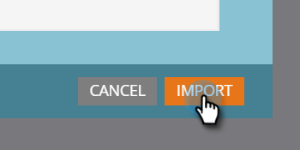

# Importera Assets med Adobe Experience Manager {#importing-assets-with-adobe-experience-manager}

Med resursväljaren kan Marketo-kunder komma åt, välja och importera AEM-resurser till Marketo [!DNL Design Studio]. **Administratörsbehörighet krävs**.

>[!AVAILABILITY]
>
>Alla har inte köpt den här funktionen. Kontakta Adobe Account Team (din kontoansvarige) för mer information.

>[!PREREQUISITES]
>
>Kontrollera att du redan har utfört [AEM-konfigurationen](/help/marketo/product-docs/core-marketo-concepts/miscellaneous/configuring-adobe-experience-manager-integration.md).

>[!IMPORTANT]
>
>Den här funktionen stöds för närvarande bara fullt ut i [!DNL Firefox]. Det stöds inte i [!DNL Safari] och kanske inte fungerar i den senaste versionen av [!DNL Chrome], beroende på dina [!DNL SameSite]-cookie-inställningar.

1. Klicka på **[!UICONTROL Design Studio]**.

   

1. Klicka på listrutan Ny och välj **[!UICONTROL Import from Adobe Experience Manager]**.

   

1. Välj i vilken mapp bilderna ska sparas.

   

1. Logga in på Adobe Experience Manager (om du inte redan gjort det).

   

1. Välj mapp. Markera sedan bilderna genom att klicka på miniatyrbilden (du kan välja upp till 10). Klicka på **[!UICONTROL Select]** när du är klar.

   

   >[!NOTE]
   >
   >Bilderna får inte vara större än 100 MB.

1. Klicka på **[!UICONTROL Import]** för att slutföra processen.

   

   Och det är allt! Klicka på **[!UICONTROL Close]** för att återgå till Design Studio.

   

## Saker att notera {#things-to-note}

* Marketo stöder för närvarande Adobe Experience Manager version 6.4 och 6.5.

* Alla användare i din instans kan visa och komma åt de bilder du importerar.

* Bilderna uppdateras inte automatiskt. Om en bild som du har importerat till Marketo [!DNL Design Studio] uppdateras i AEM måste du importera den manuellt till Marketo igen.
