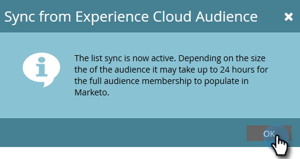

# Synkronisera en publik från Adobe Experience Cloud {#sync-an-audience-from-adobe-experience-cloud}

>[!NOTE]
>
>En HIPAA-klar distribution av en Marketo-instans kan inte använda den här integreringen.

>[!PREREQUISITES]
>
>[Konfigurera Adobe organisationsmappning](/help/marketo/product-docs/adobe-experience-cloud-integrations/set-up-adobe-organization-mapping.md){target="_blank"}

## Synkronisera en publik {#how-to-sync-an-audience}

1. Klicka på panelen **[!UICONTROL Database]** i Min Marketo.

   

1. Klicka på listrutan **[!UICONTROL New]** och välj **[!UICONTROL Sync from Experience Cloud Audience]**.

   

1. Klicka på listrutan **[!UICONTROL Audience Library Folder]** och välj önskad ursprungsmapp.

   

1. Välj en **[!UICONTROL Audience Name]**.

   

1. För målet kan du välja en befintlig lista eller skriva namnet på en ny. I det här exemplet skapar vi en ny. Klicka på **[!UICONTROL Sync]** när du är klar.

   

1. Klicka på **[!UICONTROL OK]**.

   

## Vanliga frågor och svar {#faq}

**Hur fungerar cookie-synkroniseringen?**

När cookie-synkronisering är aktiverat för din Marketo-prenumeration försöker Marketo munchkin.js att hämta och lagra Adobe ECID:n för den Adobe IMS-organisation som du angav under integreringsinställningen och matcha dessa ECID:n med motsvarande Marketo cookie-identifierare. Detta gör att Marketo anonyma användarprofiler kan berikas med Adobe ECID:n.

Ytterligare ett steg krävs för att koppla den anonyma användarprofilen till en lead-profil, som identifieras med ett vanligt e-postmeddelande. Exakt hur detta fungerar [ beskrivs här](/help/marketo/product-docs/reporting/basic-reporting/report-activity/tracking-anonymous-activity-and-people.md){target="_blank"}.

**Varför skiljer sig liststorleken i Marketo från den i Adobe?**

En person kan inte heller synkronisera över om vi inte kan koppla ett ECID-cookie-ID till en känd person i Marketo.

**Är detta en engångssynkronisering?**

Du behöver bara initiera synkroniseringen en gång. Därefter synkroniseras posterna automatiskt. Den första synkroniseringen kan ta upp till 24 timmar. Nya poster synkroniseras om 2-3 timmar.
