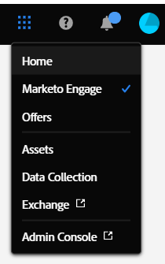

# Översikt över enhetligt gränssnitt {#unified-shell-overview}

Enhetligt gränssnitt anpassar &quot;skalets&quot; utseende och känsla i Adobe Experience Cloud program och tjänster. Men det är mer än bara en ny design. Det är ett ensidigt program som levererar användarupplevelser i en enda instans.

## Användarflöde {#user-flow}

**Enhetligt gränssnittsflöde**

Om du inte redan är inloggad på en Adobe Experience Cloud-produkt loggar du in direkt på [!DNL Marketo Engage] här: [https://experience.adobe.com/marketo-engage](https://experience.adobe.com/marketo-engage).

Om du _är_ som redan är inloggad på en Adobe Experience Cloud-produkt klickar du bara på menyikonen och väljer **[!DNL Marketo Measure]**.

>[!NOTE]
>
>Listrutan kan se annorlunda ut beroende på vilka Adobe Experience Cloud-produkter du prenumererar på.

## Nya funktioner {#new-features}

Förutom det uppdaterade utseendet och känslan kommer du att märka följande funktioner:

**Integrerat Help Center**

Sök efter supportartiklar, skicka in biljetter, ge feedback inifrån [!DNL Marketo Engage] program.

**Programväxlare**

De som har tillgång till flera Adobe-produkter kan enkelt växla mellan dem.

**Meddelanden**

Visa och interagera med produktspecifika meddelanden och allmänna produktmeddelanden för Adobe direkt i programmet.

**Inställningar för Adobe**

Klicka på din profilikon om du vill ändra språk eller andra inställningar för hela Adobe. Du kan också skapa [!DNL Marketo Engage]-specifika ändringar genom att klicka **Mina inställningar**.

## Vanliga frågor {#faq}

**Jag kan inte logga in på [!DNL Marketo Engage] via det enhetliga gränssnittet. Vad kan problemet vara?**

Om du kan logga in på Adobe Experience Cloud, men sedan ser felet&quot;Det gick inte att läsa in sidan&quot;, kan problemet finnas på [!DNL Marketo Engage] sida. Kontakta [Marketo Support](https://nation.marketo.com/t5/support/ct-p/Support) om du behöver hjälp.

**Vart gick användarhistorik, global sökning, Marketo-meddelanden och aktivitetsfältet?**

De här funktionerna har flyttats från den övre navigeringen till ett nytt fält till vänster i Unified Shell.
