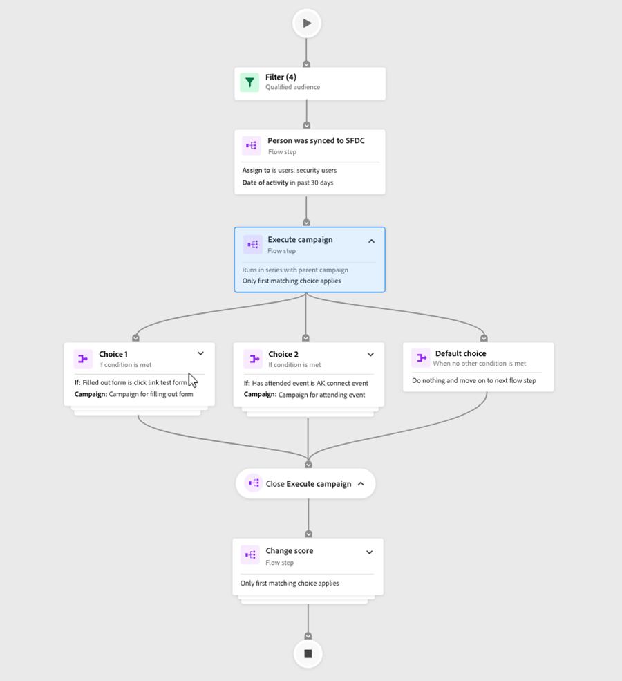

# Översikt över Engagement Map {#engagement-map-overview}

Med Engagement Map kan ni bygga ut återanvändbara smarta kampanjer med hjälp av intuitiva bilder. Den är helt bakåtkompatibel med alla befintliga Marketo Engage Smart Campaigns, utan att nuvarande funktioner går förlorade.

>[!NOTE]
>
>Engagement Map är för närvarande tillgängligt i smarta kampanjer. Det är inte tillgängligt i Program.

## Åtkomst till engagemangskarta {#accessing-engagement-map}

Navigera till en befintlig kampanj och klicka på **Engagement Map** -knappen.

När du är med på Engagement Map visas två flikar: [Engagement Map](/help/marketo/product-docs/core-marketo-concepts/engagement-map/engagement-map-tab.md){target="_blank"} and [Settings](/help/marketo/product-docs/core-marketo-concepts/engagement-map/settings-tab.md){target="_blank"}.

## Kortbeskrivningar {#card-descriptions}

**Utlösare**: I kampanjer som innehåller utlösare har kartan ett kort för utlösaröversikt. Om du klickar på den visas ett kort för varje utlösare samt en utfällbar panel med ytterligare information.

**Filter**: I kampanjer som innehåller filter innehåller kartan ett kort för filteröversikt. Om du klickar på den visas en utfällbar panel med ytterligare information om varje filter.

**Flödessteg**: Varje kampanj kommer att innehålla ett kort för varje flödessteg. Om du klickar på dem visas en utfällbar panel med ytterligare information.

**Val**: Om ett flödessteg innehåller ett eller flera alternativ visas ett kort för varje val när du klickar på flödeskortet, samt en utfällbar panel med ytterligare information.

## Kapslade kampanjer {#nested-campaigns}

* Om en kampanj innehåller ett Request- eller Execute Campaign-flödessteg visas information om den kampanj som anropas samt en utfällbar panel med ytterligare information om du klickar på flödeskortet.

* Om en kampanj innehåller ett Request- eller Execute Campaign-flödessteg med alternativ, visas ett kort för varje val när du klickar på flödeskortet, samt en utfällbar panel med mer information om alternativen. Om du klickar på varje alternativkort visas information om den kampanj som anropas samt en utfällbar panel med mer information.

* Om någon av de kapslade kampanjerna dessutom har ett flödessteg för att begära eller köra kampanj, visas information om kampanjen om du klickar på flödeskortet. Detsamma gäller när flödessteget innehåller alternativ.

## Övre navigering {#top-navigation}

Den övre navigeringen innehåller följande funktioner:

* Kampanjnamn och åtkomst till&quot;Redigera kampanj&quot; modal, du kan redigera kampanjnamnet och beskrivningen här.

* Kampanjstatus och kampanjtyp visas under kampanjnamnet

* Knappen Aktivera/inaktivera för utlösarkampanjer

* Redigera smart lista - du kommer att navigeras till gränssnittet Smart lista på en ny flik där du kan lägga till eller redigera dina flödessteg

* Redigera flöde - du kommer att navigeras till Flödesgränssnittet på en ny flik där du kan lägga till eller redigera din smarta lista

* Export - Detta hämtar en bild av kampanjvisualiseringen. Den nedladdade versionen återspeglar alla grenar som du har expanderat

* Visa kampanjmedlemmar - En ny flik med information om kampanjmedlemmar öppnas.

>[!NOTE]
>
>Ändringar som görs på en öppen smart lista och Flödesflik visas på fliken Engagement Map när du uppdaterar. Den uppdateras inte automatiskt. Uppdateringar och redigeringar som sparas automatiskt visas när fliken för aktivitetskartan uppdateras.

## Vanliga frågor {#faq}

**Måste jag bygga om alla mina kampanjer i Engagement Map?**

Nej. Engagement Map har fullständig bakåtkompatibilitet. Med en enkel musklickning kan ni se alla era befintliga kampanjer i gränssnittet för den visuella engagemangskartan.

**Betyder Engagement Map i Marketo Engage att jag inte längre har tillgång till mappstrukturen och måste lära mig hur man bygger en Smart Campaign?**

Nej. Det fina med Engagement Map är att det ger er det bästa av två världar; det kompletterar det sätt på vilket ni bygger kampanjer just nu. Du kan välja om du vill använda det befintliga användargränssnittet eller skapa/visualisera i det nya användargränssnittet. Alla användare kommer fortfarande att få tillgång till de kraftfulla funktionerna i Marketo Engage, som nu kompletteras av ett visuellt verktyg.

**Är Engagement Map ett betalt tillägg?**

Nej. Alla befintliga och nya användare av Marketo Engage under alla prenumerationer har tillgång till den här kostnadsfria funktionen.

**Är det jag som administratör för Marketo Engage som ansvarar för att aktivera/inaktivera Engagement Map?**

Nej. Engagement Map kommer att vara tillgängligt för alla användare i deras instanser. Du kan inte aktivera/inaktivera den för vissa användare, arbetsytor osv.

**Finns det för närvarande allt som finns tillgängligt i smarta kampanjer även i Engagement Map?**

Ja. Engagement Map har fullständig funktionsparitet med smarta kampanjer.

**På vilket sätt skiljer sig detta från andra visuella verktyg?**

Det finns tre viktiga saker som skiljer Engagement Map åt:

* Flexibilitet: Hantera och validera enkelt sammankopplade eller djupt inkapslade kampanjer med visualisering.

* Funktion: Alla bilder är utanför ramarna, vilket gör dem enklare att använda. Med den kapslade strukturen kan du dyka in och få hela bilden.

* Styrka: Du behåller alla finesser i Marketo Engage, nu i ett visuellt format.

>[!MORELIKETHIS]
>
>* [Fliken Åtagandekarta](/help/marketo/product-docs/core-marketo-concepts/engagement-map/engagement-map-tab.md){target="_blank"}
>* [Fliken Inställningar](/help/marketo/product-docs/core-marketo-concepts/engagement-map/settings-tab.md){target="_blank"}
