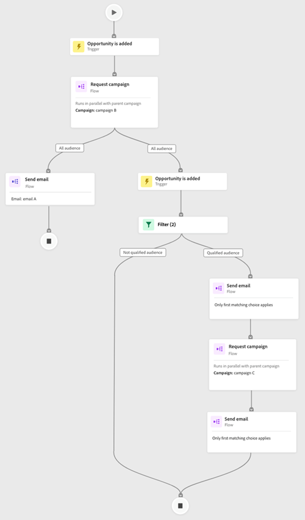
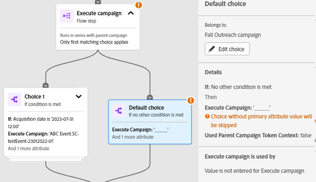

# Fliken Åtagandekarta {#engagement-map-tab}

Engagement Map representeras av en serie utlösar-, filter- och flödeskort. Om du klickar på varje kort visas ytterligare information.

Utlösaröversikt: Det här kortet visar antalet utlösare i kampanjen. Om du klickar på den visas ett kort för varje utlösare samt en utfällbar panel med följande information:

* Kampanj som utlösaren tillhör
* Lista med utlösarnamn
* Knappen Redigera utlösare

  

Utlösardetalj: Det här kortet visar utlösarnamn. Om du klickar på den visas en utfällbar panel med följande information:

* Kampanj som utlösaren tillhör
* Lista över begränsningar som är kopplade till utlösaren
* Knappen Redigera utlösare

  

Filter: Om du klickar på det här kortet visas en utfällbar panel med följande information:

* Kampanj som utlösaren tillhör
* Uppskattat antal personer som är kvalificerade för filtret
* Lista över filter och deras respektive begränsningar
* Knappen Redigera filter

  

Flödessteg: Om ett flödessteg innehåller alternativ visas flödesstegets namn på kortet. Om du klickar på den visas en utfällbar panel med följande information:

* Kampanj som flödessteget tillhör
* Lista med urvalsvillkor som är kopplade till flödessteget
* Knappen Redigera flöde

  

Flödessteg: Om ett flödessteg gör det _not_ inkluderar eventuella alternativ. Kortet visar attribut som är kopplade till flödessteget. Om du klickar på den visas en utfällbar panel med följande information:

* Kampanj som flödessteget tillhör
* Lista med attribut som är kopplade till flödessteget
* Knappen Redigera flöde

  

## Flödessteg för körnings- och begärandekampanjer {#flow-step-for-execute-and-request-campaigns}

* Om flödesteget Kör eller Begär kampanj inte innehåller några alternativ visas kampanjens namn på kortet. Om du klickar på kortet visas en utfällbar panel med följande information:

   * Kampanj som flödessteget tillhör
   * Knappen Redigera flöde
   * Lista med attribut som är kopplade till flödessteget
   * Knappen Visa lista, som öppnar en lista med kampanjer som använder den specifika kampanj för begäran/körning

>[!NOTE]
>
>Du kan redigera flödesstegen från en primär kampanj. Om du vill redigera kapslade kampanjer måste du navigera till kampanjen via länken i panelen för utfällbara kampanjer.

* Om flödesteget Kör eller Begär kampanj innehåller alternativ visas kampanjens namn på kortet. Om du klickar på kortet visas en utfällbar panel med följande information:

   * Kampanj som flödessteget tillhör
   * Lista med urvalsvillkor som är kopplade till flödessteget
   * Knappen Redigera flöde

  

  

* Om en körnings- eller begärandekampanj innehåller alternativ expanderas klickningen på flödeskortet för att visa alla alternativ på enskilda kort. Om du klickar på urvalskortet utökas kampanjen som är kopplad till det specifika valet samt en utfällbar panel med följande information visas:

   * Campaign som valet tillhör
   * Knappen&quot;Redigera val&quot;
   * Lista med urvalsvillkor som är kopplade till flödessteget
   * Knappen Visa lista, som öppnar en lista med kampanjer som använder den specifika kampanj för begäran/körning

  

## Visualisera en kapslad körningskampanj {#visualizing-a-nested-execute-campaign}

PICKAD REDIGERING HÄR -

Kör kampanjer i serie med de överordnade kampanjerna som är kvalificerade för en körbar kampanj som slutför alla flödessteg från kampanjen och återgår till den primära kampanjen för att fortsätta genom kampanjens flödessteg.

Nedan visas ett exempel på en smart kampanj,&quot;Campaign A&quot;, som innehåller ett körningsflöde för kampanjer. Tänk på&quot;Campaign A&quot; som din primära kampanj.

1. Om du klickar på det körda kampanjflödeskortet expanderas det och visar information om&quot;Campaign B&quot;.
1. &quot;Campaign B&quot; innehåller ett filter som ger en större publik än en kvalificerad och inte kvalificerad målgrupp.
1. Kvalificerad målgrupp går igenom de flödessteg som är kopplade till&quot;Campaign B&quot;.
1. Alla målgrupper (kvalificerade och inte kvalificerade) går tillbaka till&quot;Campaign A&quot; och går vidare till nästa flödessteg.

SLUTAD REDIGERING HÄR—

Du kan klicka på steget Kör kampanj i&quot;Campaign B&quot;, som kommer att expandera för att visa alternativkort och kampanjer som är kopplade till varje val.

## Visualiserar begärandekampanj {#visualizing-request-campaign}

Begärandekampanjer körs parallellt med den överordnade kampanjen, dvs. leads som kvalificerar för en begärandekampanj slutför alla flödessteg från kampanjen och avslutar kampanjen. Samtidigt kommer samma uppsättning leads också att gå igenom flödessteg från den primära kampanjen

Här är ett exempel på den smarta kampanjen&quot;Campaign A&quot;, som innehåller ett flödessteg för begärandekampanjer. Ni kan tänka er&quot;Campaign A&quot; som er primära kampanj.

1. Om du klickar på flödeskortet för begärandekampanjen expanderas det så att information om&quot;Campaign B&quot; visas
1. Campaign B innehåller filter som ger ut till en kvalificerad målgrupp.
1. Kvalificerad målgrupp går igenom de flödessteg som är kopplade till&quot;Campaign B&quot;
1. Samtidigt går alla målgrupper vidare till nästa flödessteg i&quot;Campaign A&quot;

   

Du kan fördjupa dig i kapslade kampanjer om något av flödesstegen innehåller ytterligare en kampanj genom att klicka på flödeskortet för att visa information om kampanjen

Här är ett exempel på en begärandekampanj med valmöjligheter.

## Felhantering {#error-handling}

Fel i smarta listor och flödessteg markeras via en felikon på kortet. Motsvarande felmeddelande visas dessutom i panelen för utskjutning.

Här är ett exempel på fel i utlösaren som visas i utlösaröversiktskortet, panelen för utskjutning samt utlösarkortet för detaljer

Fel på filterkortet kan innehålla

Fel i den smarta listan som gör att kvalificerade målgrupper inte visas

Fel i filterlogik

Fel i begränsningar eller avsaknad av sådana i ett eller flera filter

Om du inte anger värden (attribut) flaggas de inte som fel, utan fortsätter att fungera som på fliken Flöde. Befintliga kampanjer kommer därför inte att störas. Om flödessteg inte innehåller några attribut visas de som varningar.

Obs! Fel i en kapslad kampanj visas inte förrän du har klickat för att expandera den kapslade kampanjen
