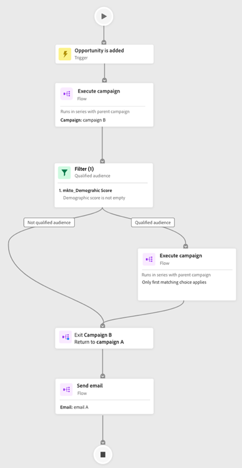

# Fliken Åtagandekarta {#engagement-map-tab}

Engagement Map representeras av en serie utlösar-, filter- och flödeskort. Om du klickar på varje kort visas ytterligare information.

Utlösaröversikt: Kortet visar antalet utlösare i kampanjen. Om du klickar på den visas ett kort för varje utlösare samt en utfällbar panel med följande information:

* Kampanj som utlösaren tillhör
* Lista med utlösarnamn
* Redigera utlösare

  

Utlösardetalj: Det här kortet visar utlösarnamnet. Om du klickar på den visas en utfällbar panel med följande information:

* Kampanj som utlösaren tillhör
* Lista över begränsningar som är kopplade till utlösaren
* Redigera utlösare

Filter: Om du klickar på det här kortet visas en utfällbar panel med följande information:

* Kampanj som filtret tillhör
* Uppskattat antal personer som är kvalificerade för filtret
* Lista över filter och deras respektive begränsningar
* Redigera filter

  

Flödessteg: Om ett flödessteg innehåller alternativ visas namnet på flödessteget på det här kortet. Om du klickar på den visas en utfällbar panel med följande information:

* Kampanj som flödessteget tillhör
* Lista med urvalsvillkor som är kopplade till flödessteget
* Redigera flödessteg

Flödessteg: Om ett flödessteg _not_ inkluderar eventuella alternativ. Kortet visar de attribut som är kopplade till flödessteget. Om du klickar på den visas en utfällbar panel med följande information:

* Kampanj som flödessteget tillhör
* Lista med attribut som är kopplade till flödessteget
* Redigera flödessteg

  

## Flödessteg för att köra och begära kampanjer {#flow-step-for-execute-and-request-campaigns}

* Om steget Kör eller Begär kampanjflöde inte innehåller några alternativ visas kampanjens namn på kortet. Om du klickar på kortet visas en utfällbar panel med följande information:

   * Kampanj som flödessteget tillhör
   * Redigera flödessteg
   * Lista med attribut som är kopplade till flödessteget
   * Knappen Visa lista, som öppnar en lista med kampanjer som använder den specifika kampanj för begäran/körning

>[!NOTE]
>
>Du kan redigera flödesstegen från en primär kampanj. Om du vill redigera kapslade kampanjer måste du navigera till kampanjen via länken i panelen för utfällbara kampanjer.

* Om steget Kör eller Begär kampanjflöde innehåller alternativ visas en utfällbar panel med följande information när du klickar på kortet:

   * Kampanj som flödessteget tillhör
   * Lista med urvalsvillkor som är kopplade till flödessteget
   * Redigera flödessteg

* Om en körnings- eller begärandekampanj innehåller alternativ expanderas klickningen på flödeskortet för att visa alla alternativ på enskilda kort. Klicka på _val_ kommer att utöka kampanjen som är kopplad till det specifika valet samt visa en utfällbar panel med följande information:

   * Campaign som valet tillhör
   * Redigera alternativ
   * Lista med urvalsvillkor som är kopplade till flödessteget
   * Visa lista, som öppnar en lista med kampanjer som använder den specifika kampanj/körningskampanj

  

## Visualisera en kapslad körningskampanj {#visualizing-a-nested-execute-campaign}

Kör kampanjer i serie med den överordnade kampanjen. Personer som är kvalificerade för en körbar kampanj slutför alla flödessteg från kampanjen och återgår till den primära kampanjen för att fortsätta genom kampanjens flödessteg.

Nedan visas ett exempel på en Smart Campaign,&quot;Campaign A&quot;, som innehåller ett steg för att köra kampanjflöde. Tänk på&quot;Campaign A&quot; som din primära kampanj.

1. Om du klickar på det körda kampanjflödeskortet expanderas det och visar information om&quot;Campaign B&quot;.
1. &quot;Campaign B&quot; innehåller ett filter som delar upp publiken i två grupper: kvalificerade och inte kvalificerade.
1. Kvalificerad publik går igenom de flödessteg som är kopplade till&quot;Campaign B&quot;.
1. Alla målgrupper (kvalificerade och inte kvalificerade) går tillbaka till&quot;Campaign A&quot; och går vidare till nästa Flow Step.

   

Du kan klicka på steget Kör kampanjflöde i&quot;Campaign B&quot;, som utökas för att visa de alternativkort och kampanjer som är kopplade till varje val.

## Visualiserar begärandekampanj {#visualizing-request-campaign}

Begär kampanjer som körs parallellt med den överordnade kampanjen. Personer som är kvalificerade för en begärandekampanj slutför alla flödessteg från kampanjen och avslutar sedan kampanjen. Samtidigt går samma uppsättning personer igenom Flödesstegen från den primära kampanjen.

Här är ett exempel på en Smart Campaign,&quot;Campaign A&quot;, som innehåller ett steg för kampanjflöde. Tänk på&quot;Campaign A&quot; som din primära kampanj.

1. Om du klickar på flödeskortet för begärandekampanjen expanderas det och visar information om&quot;Campaign B&quot;
1. &quot;Campaign B&quot; innehåller ett filter som delar upp publiken i två grupper: kvalificerade och inte kvalificerade.
1. Kvalificerad publik går igenom de flödessteg som är kopplade till&quot;Campaign B&quot;.
1. Samtidigt går alla målgrupper vidare till nästa Flow Steps i&quot;Campaign A&quot;.

   

Du kan fördjupa dig i dina kapslade kampanjer om något av Flow Steps innehåller en annan begärandekampanj genom att klicka på flödeskortet för att visa information om kampanjen.

Här är ett exempel på en frågekampanj med valmöjligheter.

## Felhantering {#error-handling}

Fel i smarta listor och flödessteg markeras med en felikon på kortet. Dessutom visas ett motsvarande felmeddelande på panelen för utskjutning.

Nedan visas ett exempel på ett fel i en utlösare som visas i utlösaröversiktskortet, utfällningspanelen och detaljutlösarkortet.

**Fel i filterkort kan vara:**

* Ett fel i Smart List som gör att kvalificerade målgrupper inte visas

* Ett fel i filterlogiken

* Ett fel i begränsningar (eller avsaknad av sådana) i ett eller flera filter

  

>[!NOTE]
>
>Fel i en kapslad kampanj syns inte förrän du har klickat för att utöka den kapslade kampanjen.
