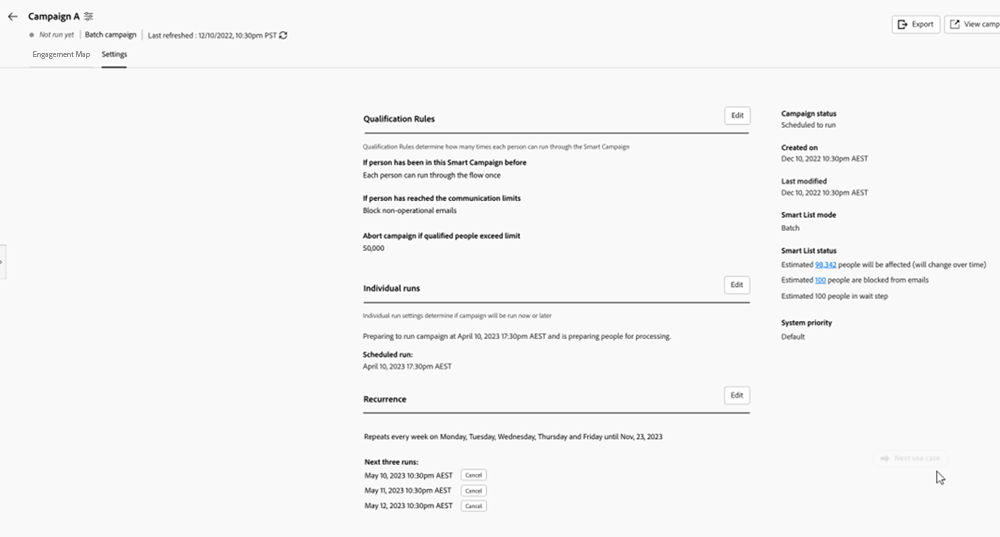

# Fliken Inställningar {#settings-tab}

Fliken Inställningar är startsida för alla kampanjinställningar, inklusive samma behörighetsgrupper och åtkomst som fliken Schema i Smarta kampanjer.

Den innehåller följande tre avsnitt.

* **Kvalificeringsregler**: Avgör hur många gånger varje person kan gå igenom det smarta kampanjflödet.

* **Enskilda körningar**: Kan användas för att schemalägga enstaka körningar, antingen direkt eller i framtiden.

* **Återkommande**: Används för att schemalägga en upprepning varje dag, vecka eller månad.

  

Kvalificeringsregler kommer att vara tillgängliga för alla kampanjer (utlösare och batch) och innehålla följande inställningar:

* Du kan bestämma hur många gånger en person går igenom en kampanj
* Möjlighet att blockera en icke-operativ kampanj om personen överskrider sin kommunikationsgräns
* Möjligheten att ange en gräns för antal avbrutna kampanjer

  

Enskilda körningar kan antingen användas för att köra en kampanj direkt eller för att konfigurera några engångskörningar i framtiden.

>[!TIP]
>
>Det är enklare att använda återkommande modal om du planerar en serie kampanjer.

Upprepningsmetoden innefattar möjligheten att ställa in ett återkommande schema varje dag, vecka eller månad. När du väl har konfigurerat programmet kan du se de tre nästa omgångarna på fliken Inställningar.

Fliken Inställningar innehåller även en snabb översikt av din smarta lista. Den innehåller följande uppgifter:

* Kampanjstatus
* Skapad den
* Senast ändrad
* Läget Smart lista
* Status för smart lista:
   * Uppskattade personer som kommer att påverkas
   * Uppskattade personer som blockeras från e-post
   * Uppskattade personer som befinner sig i ett väntesteg

Behörighetsuppsättningar och fel på fliken Inställningar:

Alla befintliga behörighetsgrupper kommer att användas på fliken Inställningar. Om knappen Redigera är nedtonad klickar du på hjälpikonen för att ta reda på varför.

>[!NOTE]
>
>Om du klickar på hjälpikonen och ser &quot;Ytterligare behörighet krävs&quot; kontaktar du Marketo Admin.

REDUNDANT SOM FÖRKLARAS OVAN KAN VI TA BORT —> Om en användare inte har tillgång till inställningarna för redigeringskampanjer har han/hon inte heller åtkomst till att avbryta schemalagda körningar.

