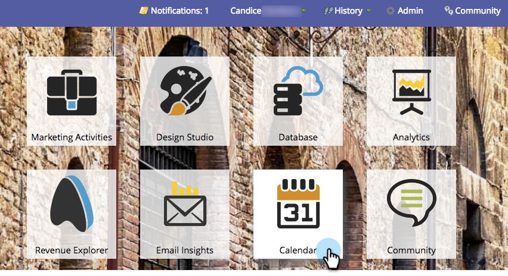

# Skapa en presentation {#create-a-presentation}

Skapa en presentation för att projicera teamets kalendervyer och mål på en HDTV. Presentations är specifikt för Workspace.

>[!AVAILABILITY]
>
>
>Alla kunder har inte köpt den här funktionen. Kontakta din säljare för mer information.

1. Gå till **kalendern**.

   

1. Klicka på **Presentation** i det nedre högra hörnet.

   

1. Klicka på **Presentationsåtgärder** och välj **Ny presentation**.

   

1. Välj ett namn för presentationen. Klicka på **Skapa**.

   

   Snyggt jobb! Nu kan du anpassa presentationen.

>[!MORELIKETHIS]
>
>[Anpassa en presentation](/help/marketo/product-docs/core-marketo-concepts/marketing-calendar/calendar-hd/customize-a-presentation.md)
