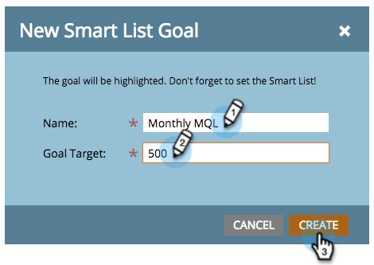

# Skapa ett mål för en smart lista {#create-a-smart-list-goal}

Målen är sätt att följa utvecklingen och motivera ert team. De kan kombineras med smarta listor för att spåra olika sorters saker i Marketo. När du har skapat ett mål för en smart lista uppdateras den automatiskt varannan timme när den används i en presentation.

Precis som för presentationer är målen [arbetsyta](/help/marketo/product-docs/administration/workspaces-and-person-partitions/understanding-workspaces-and-person-partitions.md)-specifika.

1. Gå till **[!UICONTROL Calendar]**.

   

1. Klicka på **[!UICONTROL Presentations]** längst ned till höger.

   

1. Klicka på fliken **[!UICONTROL Goals]**.  

   

1. Dra **[!UICONTROL Smart List Goal]** till arbetsytan.

   

1. Ange ett namn för målet och ange **[!UICONTROL Goal Target]**. Klicka sedan på **[!UICONTROL Create]**.

   

1. [Definiera den smarta listan](/help/marketo/product-docs/core-marketo-concepts/smart-lists-and-static-lists/creating-a-smart-list/find-and-add-filters-to-a-smart-list.md). Möjligheterna är oändliga!

   

1. När den smarta listan är klar klickar du på knappen **[!UICONTROL Close]** och går tillbaka till föregående flik.

   

   Titta på det där! Målet för den smarta listan har skapats.

   
