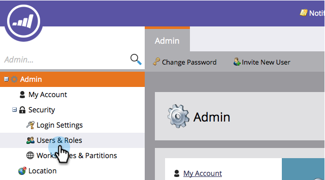

# Utfärda/återkalla en licens för en marknadsföringskalender {#issue-revoke-a-marketing-calendar-license}

>[!NOTE]
>
>**Administratörsbehörigheter krävs**

Om du vill använda dina [platser i marknadsföringskalendern](/help/marketo/product-docs/core-marketo-concepts/marketing-calendar/understanding-the-calendar/navigating-the-marketing-calendar.md){target="_blank"} måste du utfärda licenser till användare som behöver åtkomst. Så här gör du.

1. Gå till avsnittet **[!UICONTROL Admin]**.

   

1. Klicka på **[!UICONTROL Users & Roles]**.

   

1. Markera användarna och klicka på **[!UICONTROL Issue License]**.

   >[!TIP]
   >
   >Använd **Ctrl/Cmd+klicka** om du vill markera flera användare samtidigt.

   

1. Markera **[!UICONTROL Enable License]** och klicka på **[!UICONTROL Save]**.

   >[!NOTE]
   >
   >Max fem licenser. Kontakta din säljare om du behöver mer information.

   

   Snyggt gjort! Visa den gröna bockmarkeringen under [!UICONTROL Calendar]?

   
