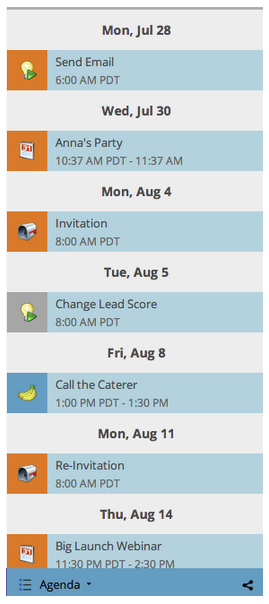

# Navigera i marknadsföringskalendern {#navigating-the-marketing-calendar}

Det är enkelt att navigera i marknadsföringskalendern. Så här gör du.

>[!PREREQUISITES]
>
>Kontrollera att du har en [licens för marknadsföringskalender](/help/marketo/product-docs/core-marketo-concepts/marketing-calendar/understanding-the-calendar/issue-revoke-a-marketing-calendar-license.md){target="_blank"} - annars visas inte marknadsföringskalenderrutan i Min Marketo.

>[!NOTE]
>
>Återkommande smarta kampanjer stöds inte i marknadsföringskalendern.

1. Gå till **marknadsföringskalendern**.

   

1. Det här är en fågelperspektiv på resurser som är schemalagda i din Marketo-instans.

   

## Ändra mellan lägen {#change-between-modes}

1. Klicka på flikarna **[!UICONTROL 3 weeks]** eller **[!UICONTROL Month]** för att växla mellan lägena.

   

## Använd dagordningsvyn {#use-the-agenda-view}

I dagordningsvyn visas alla dina bidrag som en lista.

1. Klicka på listrutan **[!UICONTROL Filter]**.

   

1. Välj vyn **[!UICONTROL Agenda]**.

   

   Häftig! Det här är en bra bild för att se allt som är planerat.

   

## Navigera genom tid {#navigate-through-time}

Utan DeLorean! Klicka bara på navigeringsknapparna.

Du kan också använda dessa kortkommandon.

| Åtgärd | Kortkommando |
|---|---|
| Tillbaka i tid | alt/opt + up |
| Framåt i tid | alt/opt + down |
| Gå till &quot;idag&quot; | alt/opt + t |

Häftig! Det här är grunderna. Du kan också anpassa vyn med hjälp av filter.

>[!MORELIKETHIS]
>
>[Filtrerar marknadsföringskalendern](/help/marketo/product-docs/core-marketo-concepts/marketing-calendar/working-with-the-calendar/filtering-the-marketing-calendar.md){target="_blank"}
