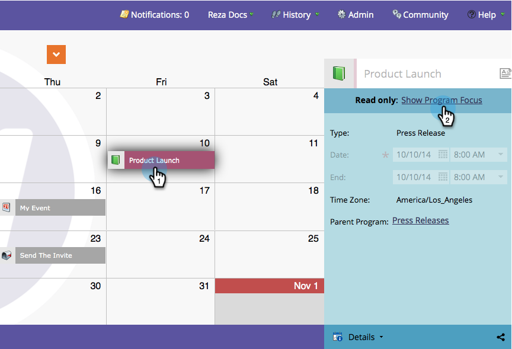

# Förstå/aktivera programfokus {#understand-enable-program-focus}

Marknadsföringskalendern ger er en fågelperspektiv på saker och ting, men den tillåter också vissa interaktioner. Du kan [skapa](../../../../product-docs/core-marketo-concepts/marketing-calendar/working-with-the-calendar/create-entries-directly-in-the-marketing-calendar.md), [redigera](../../../../product-docs/core-marketo-concepts/marketing-calendar/working-with-the-calendar/edit-entries-directly-in-the-marketing-calendar.md), [ta bort](../../../../product-docs/core-marketo-concepts/marketing-calendar/working-with-the-calendar/delete-entries-directly-in-the-marketing-calendar.md)och [bekräfta](../../../../product-docs/core-marketo-concepts/marketing-calendar/working-with-the-calendar/confirm-entries-directly-in-the-marketing-calendar.md) poster. För att kunna interagera med tävlingsbidragen måste du först fokusera på ett program.

1. Gå till **Marketing** **Calendar**.

   

1. Markera ett tävlingsbidrag och klicka på **Visa programfokus**.

   

1. Observera att vi nu fokuserar på programmet&quot;Pressmeddelande&quot;.

   

   >[!NOTE]
   >
   >Om du fokuserar på ett program kan du bara interagera med tävlingsbidrag som tillhör det och skapa nya tävlingsbidrag som lagras av det.

1. När du är klar kan du fokusera på att interagera med andra program/tävlingsbidrag.

   

Häftig! Lär dig interagera med tävlingsbidragen nu.

>[!NOTE]
>
>**Relaterade artiklar**
>
>* [Skapa transaktioner direkt i marknadsföringskalendern](../../../../product-docs/core-marketo-concepts/marketing-calendar/working-with-the-calendar/create-entries-directly-in-the-marketing-calendar.md)
>* [Redigera poster direkt i marknadsföringskalendern](../../../../product-docs/core-marketo-concepts/marketing-calendar/working-with-the-calendar/edit-entries-directly-in-the-marketing-calendar.md)
>* [Radera transaktioner direkt i marknadsföringskalendern](../../../../product-docs/core-marketo-concepts/marketing-calendar/working-with-the-calendar/delete-entries-directly-in-the-marketing-calendar.md)
>* [Bekräfta transaktioner direkt i marknadsföringskalendern](../../../../product-docs/core-marketo-concepts/marketing-calendar/working-with-the-calendar/confirm-entries-directly-in-the-marketing-calendar.md)

>

