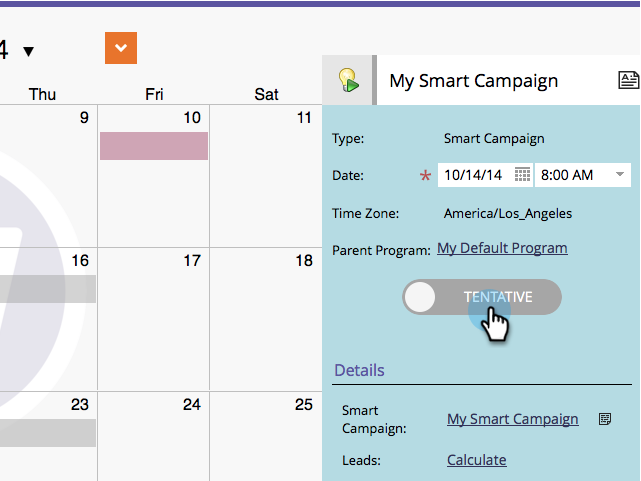

# Bekräfta transaktioner direkt i marknadsföringskalendern {#confirm-entries-directly-in-the-marketing-calendar}

Smarta kampanjer och e-postprogram kan skapas som preliminära tävlingsbidrag och måste bekräftas för att något ska hända. Så här gör du.

1. Gå till **kalendern**.

   

1. Markera den post som du vill bekräfta och klicka på **Visa programfokus**.

   

1. Bekräfta inlägget.

   

   Bekräftelse kör en rad valideringsprocesser och om allt checkar ut bekräftas posten.

   

