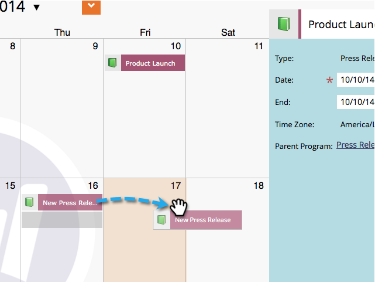
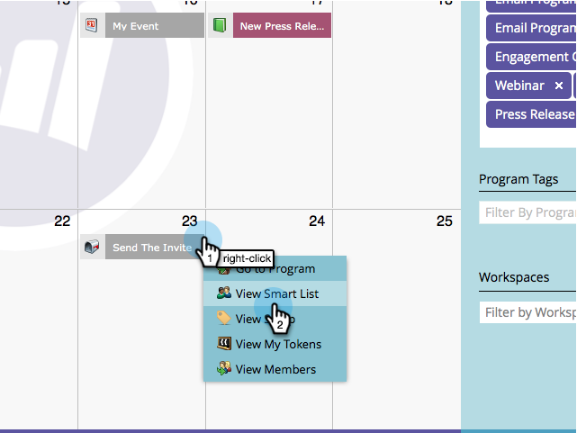

# Redigera poster direkt i marknadsföringskalendern {#edit-entries-directly-in-the-marketing-calendar}

I programfokusläget kan du snabbt ändra kalenderposterna. Så här gör du.

## Aktivera programfokus {#enable-program-focus}

1. Gå till **kalendern**.

   

1. Markera en post som tillhör programmet som du vill fokusera på och klicka på **Visa programfokus**.

   

## Schemalägg om post {#reschedule-entry}

1. Du behöver bara dra och släppa ett inlägg för att ändra schemat.

   

## Redigera postnamn {#edit-entry-name}

1. Markera den post som du vill byta namn på.

   

1. Redigera postens namn.

   

   >[!TIP]
   >
   >Du kan också redigera beskrivningen.
   >
   >
   >   >

## Konvertera posttyp {#convert-entry-type}

När du snabbt har skrivit in dina grundläggande poster kan du konvertera dem till deras slutliga form.

1. Sök efter och markera den grundläggande post som du vill konvertera och ändra dess typ.

   

## Redigera anmälningsinformation {#edit-entry-details}

Du kan snabbt få åtkomst till olika delar av tävlingsbidragen för redigering.

1. Högerklicka på en post och markera det område som du vill redigera.

   

Så ja! Som du ser finns det många saker du kan göra direkt i marknadsföringskalendern.

>[!NOTE]
>
>**Relaterade artiklar**
>
>* [Radera transaktioner direkt i marknadsföringskalendern](https://community.marketo.com/MarketoArticle?id=kA050000000LPDyCAO)

>

