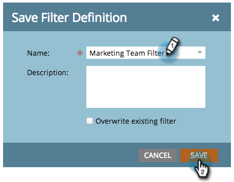

# Spara en filterdefinition i marknadsföringskalendern {#saving-a-filter-definition-in-the-marketing-calendar}

När du sparar ett filter kan du växla fram och tillbaka mellan olika filterdefinitioner.

>[!PREREQUISITES]
>
>[Filtrerar marknadsföringskalendern](/help/marketo/product-docs/core-marketo-concepts/marketing-calendar/working-with-the-calendar/filtering-the-marketing-calendar.md){target="_blank"}

1. Definiera filtret.

   

1. Klicka på ikonen Spara.

   

1. Ge filtret ett namn. Klicka på **[!UICONTROL Save]**.

   

   Filtret sparas nu.

   

   Om du vill kan du [skicka en kopia](/help/marketo/product-docs/core-marketo-concepts/marketing-calendar/working-with-the-calendar/sharing-a-filter-definition-in-the-marketing-calendar.md){target="_blank"} av definitionen till andra Marketo-användare.

   >[!NOTE]
   >
   >[Dela en filterdefinition i marknadsföringskalendern](/help/marketo/product-docs/core-marketo-concepts/marketing-calendar/working-with-the-calendar/sharing-a-filter-definition-in-the-marketing-calendar.md){target="_blank"}
