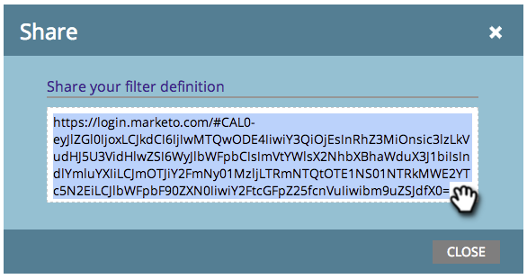

# Dela en filterdefinition i marknadsföringskalendern {#sharing-a-filter-definition-in-the-marketing-calendar}

Filter kan delas mellan olika användare.

>[!PREREQUISITES]
>
>* [Skapa ett filter i marknadsföringskalendern](filtering-the-marketing-calendar.md)
>* [Spara en filterdefinition i marknadsföringskalendern](saving-a-filter-definition-in-the-marketing-calendar.md)

>

>[!NOTE]
>
> Om du gör en ändring i ett sparat filter måste du dela det igen; redigeringarna återspeglas inte för andra användare förrän du gör det.

1. Välj det filter som du vill dela.

   

1. Klicka på delningsikonen i det nedre högra hörnet.

   

1. Kopiera URL-adressen och dela den med andra Marketo-användare.

   

   >[!NOTE]
   >
   >Användarbehörigheter påverkar synligheten.

