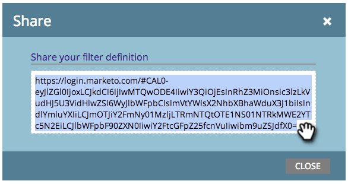

# Dela en filterdefinition i Marketing Calendar {#sharing-a-filter-definition-in-the-marketing-calendar}

Filter kan delas mellan olika användare.

>[!PREREQUISITES]
>
>* [Skapa ett filter i marknadsföringskalendern](/help/marketo/product-docs/core-marketo-concepts/marketing-calendar/working-with-the-calendar/filtering-the-marketing-calendar.md)
>* [Sparar en filterdefinition i marknadsföringskalendern](/help/marketo/product-docs/core-marketo-concepts/marketing-calendar/working-with-the-calendar/saving-a-filter-definition-in-the-marketing-calendar.md)

>[!NOTE]
>
> Om du gör en ändring i ett sparat filter måste du dela det igen. Ändringarna återspeglas inte för andra användare förrän du gör det.

1. Välj det filter som du vill dela.

   

1. Klicka på delningsikonen längst ned till höger.

   

1. Kopiera webbadressen och dela den med andra Marketo-användare.

   

   >[!NOTE]
   >
   >Användarbehörigheter påverkar synligheten.
