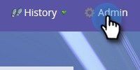

# Konfigurerar Adobe Experience Manager-integrering {#configuring-adobe-experience-manager-integration}

Konfigurera AEM så att du kan komma åt, välja och importera AEM till Marketos Design Studio.

>[!NOTE]
>
>**Administratörsbehörigheter krävs**

>[!CAUTION]
>
>För närvarande stöds den här funktionen endast fullt ut i Firefox. Det stöds inte i Safari och kanske inte fungerar i den senaste versionen av Chrome (version 80), beroende på inställningarna för cookie-filen för samma plats.

1. Gå till Adobe Experience Manager (URL:en är specifik för ditt företag).

   

1. Du kan logga in med Adobe eller logga in lokalt. I det här exemplet loggar vi in lokalt.

   

1. I **Verktyg** klickar du på **Åtgärder** och väljer **Webbkonsol**.

   

1. I webbläsaren söker du efter &quot;Adobe Granite Cross-Origin Resource Sharing Policy&quot; (på Windows, cmd+f på Mac).

   

1. Klicka på **+**-tecknet till höger.

   

1. I textrutan **Tillåtna original (Regexp)** skriver du &quot;https://.*\.marketo\.com&quot; (utan citattecken) och klicka på **Spara**.

   

1. Klicka på **Webbkonsol** i sidhuvudet överst på sidan och välj **Systeminformation**.

   

1. Klicka på knappen **Starta om** under Serverinformation.

   

1. Bekräfta genom att klicka på **OK**.

   

1. I Marketo Classic klickar du på **Admin**.

   

1. Under Integrering väljer du **Adobe Experience Manager**.

   

1. Klicka på **Redigera**.

   

1. Ange din AEM-URL och klicka på **OK**.

   

   Du är redo! Du kan nu [importera AEM till Design Studio i Marketo Skyn](http://help.marketo.com/hc/en-us/articles/360036765993).

