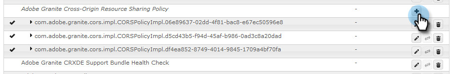

# Konfigurera Adobe Experience Manager Integration {#configuring-adobe-experience-manager-integration}

Konfigurera AEM så att du kan komma åt, välja och importera AEM till Marketo Design Studio.

>[!NOTE]
>
>**Administratörsbehörigheter krävs**

>[!CAUTION]
>
>För närvarande stöds den här funktionen endast fullt ut i Firefox. Det stöds inte i Safari och kanske inte fungerar i den senaste versionen av Chrome, beroende på inställningarna för cookie-filen för samma plats.

1. Gå till Adobe Experience Manager (URL:en är specifik för ditt företag).

   

1. Du kan logga in med Adobe eller logga in lokalt. I det här exemplet loggar vi in lokalt.

   

1. I **verktyg**, klicka **Operationer** och markera **Webbkonsol**.

   

1. I webbläsaren söker du efter &quot;Adobe Granite Cross-Origin Resource Sharing Policy&quot; (på Windows, cmd+f på Mac).

   

1. Klicka på **+** till höger.

   

1. I **Tillåtna original (Regexp)** textruta, skriva in `https://.*\.marketo\.com` och klicka **Spara**.

   

1. Klicka på i sidhuvudet högst upp på sidan **Webbkonsol** och markera **Systeminformation**.

   

1. Klicka på **Starta om** -knappen.

   

1. Klicka **OK** för att bekräfta.

   

1. I Marketo Classic klickar du på **Administratör**.

   

1. Under Integrering väljer du **Adobe Experience Manager**.

   

1. Klicka **Redigera**.

   

1. Ange AEM URL och klicka på **OK**.

   

   Du är redo! Nu kan du [importera AEM till Design Studio i Marketo Sky](https://experienceleague.adobe.com/docs/marketo/sky/design-studio/importing-assets-with-adobe-experience-manager.html?lang=en#design-studio).
