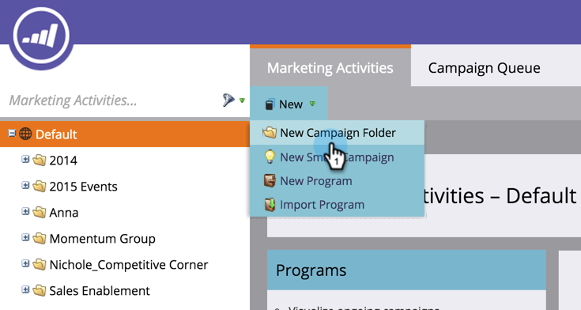

# Skapa ny kampanjmapp {#create-new-campaign-folder}

Campaign-mappar hjälper dig att behålla en aktuell arbetsyta. Följ dessa enkla steg och du är på väg att automatisera magin.

1. Gå till **Marknadsföringsaktiviteter**.

   

1. Välj **Nytt**.

   

1. Välj **Ny kampanjmapp**.

   

1. Ange **Namn** för kampanjmappen.

   

1. Valfritt: Ange **Beskrivning** och klicka **Skapa**.

   >[!TIP]
   >
   >Beskrivningar är till för andra användare av prenumerationen. Dina kunder kommer inte att se det här meddelandet.

   

   Häftig! Du har just skapat en kampanjmapp. Kolla in den i trädet.

   

   Nu när [skapa ett nytt program](/help/marketo/product-docs/core-marketo-concepts/programs/creating-programs/create-a-program.md), kommer du att se den här kampanjmappen som ett alternativ.

>[!MORELIKETHIS]
>
>* [Skapa ett program](/help/marketo/product-docs/core-marketo-concepts/programs/creating-programs/create-a-program.md)
>* [Skapa en ny smart kampanj](/help/marketo/product-docs/core-marketo-concepts/smart-campaigns/creating-a-smart-campaign/create-a-new-smart-campaign.md)

