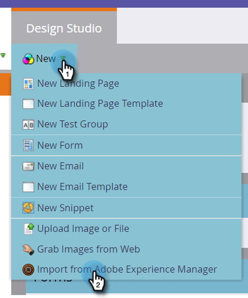

# Importera resurser med Adobe Experience Manager {#importing-assets-with-adobe-experience-manager}

Med Resursväljaren kan Marketo-kunder komma åt, välja och importera AEM till Marketos Design Studio. **Administratörsbehörighet krävs**.

>[!AVAILABILITY]
>
>
>Alla kunder har inte köpt den här funktionen. Kontakta din Customer Success Manager för mer information.

>[!PREREQUISITES]
>
>Kontrollera att du redan har utfört [AEM Configuration](/help/marketo/product-docs/core-marketo-concepts/miscellaneous/configuring-adobe-experience-manager-integration.md).

>[!CAUTION]
>
>För närvarande stöds den här funktionen endast fullt ut i Firefox. Det stöds inte i Safari och kanske inte fungerar i den senaste versionen av Chrome (version 80), beroende på inställningarna för cookie-filen för samma plats.

1. Klicka på **Design Studio**.

   

1. Klicka på listrutan Ny och välj **Importera från Adobe Experience Manager**.

   

1. Välj i vilken mapp bilderna ska sparas.

   

1. Logga in på Adobe Experience Manager (om du inte redan gjort det).

   

1. Välj mapp. Markera sedan bilderna genom att klicka på miniatyrbilden (du kan välja upp till 10). Klicka på **Välj** när du är klar.

   

   >[!NOTE]
   >
   >Bilderna får inte vara större än 100 MB.

1. Klicka på **Importera** för att slutföra processen.

   

   Och det är allt! Klicka på **Stäng** för att återgå till Design Studio.

   

## Saker att notera {#things-to-note}

Marketo har för närvarande stöd för Adobe Experience Manager version 6.4 och 6.5.

Alla användare i din instans kan visa och komma åt de bilder du importerar.

Bilderna uppdateras inte automatiskt. Om en bild som du har importerat till Marketo Design Studio uppdateras i AEM måste du manuellt importera den till Marketo igen.
