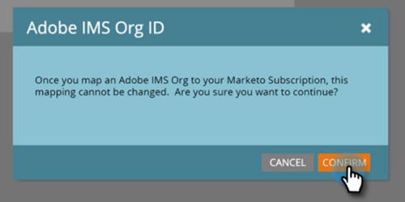

# Konfigurera Adobe Experience Cloud Audience Sharing {#set-up-adobe-experience-cloud-audience-sharing}

Om du vill dela målgruppsdata med dina Adobe-program måste du först ange dina Adobe IMS-organisationsuppgifter i Marketo. Så här gör du.

>[!NOTE]
>
>En HIPAA-klar distribution av en Marketo-instans kan inte använda den här integreringen.

1. I Marketo klickar du på **Admin**.

   

1. Klicka på **Experience Cloud målgruppsdelning** under Integrering.

   

1. Klicka på **Redigera**.

   

1. Ange ditt Adobe IMS-organisations-ID (läs om hur du hittar [här](https://docs.adobe.com/content/help/en/control-panel/using/faq.html)) och klicka på **OK**.

   

1. Klicka på **Bekräfta**.

   

1. Klicka på **Stäng**.

   

   >[!NOTE]
   >
   >Av säkerhetsskäl måste du vara organisationsadministratör för den Adobe-organisation som du vill mappa till. Annars misslyckas åtgärden.

1. Om du _inte_ redan är inloggad visas ett popup-fönster på en ny flik/i ett nytt fönster. Logga in på din Adobe-organisation (den här åtgärden verifierar organisationsåtkomsten).

   Och det är allt! Nu kan du börja [dela målgruppsdata](/help/marketo/product-docs/core-marketo-concepts/smart-lists-and-static-lists/static-lists/send-a-list-to-adobe-experience-cloud.md).
