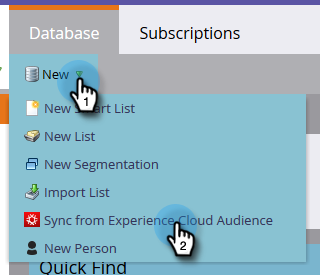

# Synkronisera en målgrupp från Adobe Experience Cloud {#sync-an-audience-from-adobe-experience-cloud}

>[!NOTE]
>
>En HIPAA-klar distribution av en Marketo-instans kan inte använda den här integreringen.

>[!PREREQUISITES]
>
>[Konfigurera Adobe Experience Cloud målgruppsdelning](/help/marketo/product-docs/core-marketo-concepts/miscellaneous/set-up-adobe-experience-cloud-audience-sharing.md)

## Synkronisera en publik {#how-to-sync-an-audience}

1. Klicka på plattan **Database** på My Marketo.

   

1. Klicka på listrutan **Nytt** och välj **Synkronisera från Experience Cloud-målgrupp**.

   

1. Klicka på listrutan **Målgruppsbiblioteksmapp** och välj önskad ursprungsmapp.

   

1. Välj ett **målgruppsnamn**.

   

1. För målet kan du välja en befintlig lista eller skriva namnet på en ny. I det här exemplet skapar vi en ny. Klicka på **Synkronisera** när du är klar.

   

1. Klicka på **OK**.

   

## Vanliga frågor och svar {#faq}

**Hur fungerar cookie-synkroniseringen?**

När cookie-synkroniseringen är aktiverad för din Marketo-prenumeration försöker Marketos munchkin.js att hämta och lagra ECID:n för Adobe för den Adobe IMS-organisation som du angav under integreringsinställningen och matcha dessa ECID:n med motsvarande Marketo-cookie-identifierare. Detta gör att Marketos anonyma användarprofiler kan berikas med Adobe ECID:n.

Ytterligare ett steg krävs för att koppla den anonyma användarprofilen till en lead-profil, som identifieras med ett enkelt textmeddelande. Exakt hur detta fungerar [beskrivs här](/help/marketo/product-docs/reporting/basic-reporting/report-activity/tracking-anonymous-activity-and-people.md).

**Varför skiljer sig liststorleken i Marketo från den i Adobe?**

En person kan inte heller synkronisera över om vi inte kan koppla ett ECID-cookie-ID till en känd person i Marketo.

**Är detta en engångssynkronisering?**

Du behöver bara initiera synkroniseringen en gång. Därefter synkroniseras posterna automatiskt. Den inledande synkroniseringen kan ta upp till 24 timmar. nya poster kommer att synkas inom 2-3 timmar.
