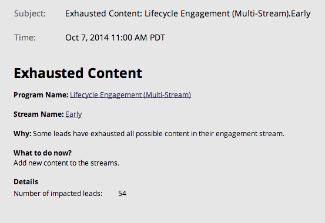

# Meddelandetyper {#notification-types}

Det finns flera meddelandetyper.

## Kampanjfel {#campaign-failure}

Kampanjfel meddelar dig om fel i smarta kampanjer.

## CRM-synkronisering {#crm-sync}

CRM-synkroniseringsmeddelanden varnar dig för viktiga problem som har uppstått med CRM-synkroniseringen, till exempel felaktiga behörigheter eller att synkroniseringen är inaktiverad.

**Microsoft Dynamics**

Dynamics-meddelanden skickas en gång var 24:e timme och innehåller leads som inte kunde synkroniseras under den tidsperioden. Vanliga orsaker till fel är dubblettleads (som ovan) eller felmatchningar av fältlängd.

**Salesforce**

Om du använder Salesforce ser felmeddelanden ut ungefär som de nedan. Typiska fel är bland annat utgångna autentiseringsuppgifter och API-gränser har överskridits.

Engagemang

När leads blir utmattade i en ström skickar vi ett meddelande.  Anmälan innehåller antalet leads som blivit utmattade och viss annan information.

Facebook

Om du försöker skicka leads till Facebook utan att godkänna användarvillkoren eller om du försöker skicka leads till Facebook efter att du har tagit bort Marketetos app.

Rensa inaktiv utlösarkampanj

Inaktivera utlösta smarta kampanjer som inte längre får någon aktivitet. Läs mer om [automatisk rensning av utlösningskampanj](../../../../product-docs/core-marketo-concepts/smart-campaigns/using-smart-campaigns/automatic-trigger-campaign-cleanup.md).

LinkedIn

När Marketo inte kan skapa en ny målgrupp, logga in eller skicka e-postmeddelanden till LinkedIn efter tre försök.

Webbtjänster

Du meddelas när du når din dagliga kvot. Kvotmängden återställs varje natt vid midnatt, centraltid.

>[!NOTE]
>
>En del felkoder som du kan få beskrivs i vår [Developer Documentation](http://developers.marketo.com/rest-api/error-codes/#response_level_error_codes).

