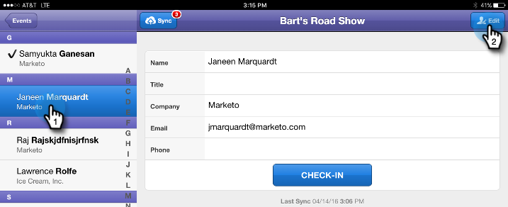

# Checka in personer i din aktivitet från surfplattan {#check-people-into-your-event-from-your-tablet}

När någon visas vid ditt evenemang hittar du deras information i appen. Efter incheckning befordras de till tillagd status när du synkroniserar till Marketo.

>[!IMPORTANT]
>
>Den 2 oktober 2023 tog Adobe bort Marketo Events-appen från alla appbutiker. Om appen redan är installerad på din surfplatta/mobila enhet kan du fortsätta använda den tills vidare. När din Marketo Engage-instans har migrerats till Adobe Identity för autentisering av Marketo, kommer du inte längre att kunna komma åt appen. [Läs mer](https://nation.marketo.com/t5/product-discussions/marketo-events-app-and-marketo-moments-app-end-of-life/m-p/340712/highlight/true#M193869){target="_blank"}.

Appen fungerar likadant på båda [!DNL iPad] och [!DNL Android], förutom mindre skillnader i layout och design.

>[!PREREQUISITES]
>
>* Skapa en händelse i Marketo och fyll i den med Inbjuden och registrerad person.

## Checka in registrerade gäster {#check-in-registered-guests}

1. Tryck på appikonen på din [!DNL iPad] eller [!DNL Android] surfplatta.

1. Tryck **[!UICONTROL Login]** för att starta Marketo Event.

   

1. Ange ditt användarnamn och lösenord för Marketo och klicka på **[!UICONTROL Login]**.

   >[!NOTE]
   >
   >Du måste ha en roll med åtkomst till databasen för att kunna se personer i appen.

1. Välj en **[!UICONTROL Event]**.

   

   >[!TIP]
   >
   >Endast händelseprogram (med undantag för webbinarier) som är schemalagda en vecka före och en vecka efter dagens datum visas.

1. På hemskärmen kan du bläddra efter registrerade gäster. Om du vill hitta en person i listan kan du:

   * Bläddra för att hitta ett namn
   * Ange ett namn i sökfältet
   * Hoppa till en viss inledande bokstav i efternamnet genom att trycka på den till höger om listan

   >[!NOTE]
   >
   >Processen är densamma på [!DNL iPad] och [!DNL Android], men skärmarna skiljer sig åt och objekten kan finnas på olika platser. Den här artikeln innehåller [!DNL iPad] gränssnitt. Jämför [!DNL Android] i det här avsnittet för referens.

   **[!DNL iPad]**

   

   **[!DNL Android]**

   

1. Tryck på det valda namnet och tryck på personposten **[!UICONTROL Check-in]**.

   

Gästen har nu statusen Attended och får en bock. Personposten uppdateras när du synkroniserar med Marketo. Den röda räknaren på knappen Synkronisera ökar för att visa antalet incheckningar sedan den senaste synkroniseringen med Marketo. Knappen Synkronisera ser annorlunda ut och finns på en annan plats för [!DNL iPad] och [!DNL Android]:

**[!DNL iPad]**

**[!DNL Android]**

>[!TIP]
>
>Om en person är inbjuden men inte har registrerat sig kan du söka efter namnet genom att klicka på **[!UICONTROL Search on Server]**, precis nedanför sökrutan. Status för Inbjuden ändras till **[!UICONTROL Attended]** för händelsen.

## Skapa en ny person på surfplattan {#create-a-new-person-on-the-tablet}

Du kan lägga till gäster som inte finns i din Marketo-databas manuellt. De checkas in automatiskt och läggs till i din databas när du synkroniserar med Marketo.

1. Klicka på **[!UICONTROL Add]**.

   **[!DNL iPad]**

   

   **[!DNL Android]**

   

1. Fyll i så många grundläggande informationsfält du kan och tryck **[!UICONTROL Done]**.

   

   >[!NOTE]
   >
   >Du kan bara använda befintliga fält. Du kan inte skapa egna.

   >[!CAUTION]
   >
   >Dubbelkontrollera e-postadressen. Andra fält kan korrigeras senare, men e-postadressen är den primära metoden för att kontakta gästen.

Den nya personen registreras som incheckad till din händelse och läggs till i Marketo-databasen med statusen Attended (Bifogad) när du synkroniserar till Marketo.

## Invertera en incheckning {#reverse-a-check-in}

Om du checkade in en person av misstag _innan du synkroniserar med Marketo_ kan du vända på statusen för Bifogad.

1. Tryck på namnet i listan och tryck sedan på **[!UICONTROL Undo]**.

   

   Alla lagade!

## Redigera en personpost vid incheckning {#edit-a-person-record-at-check-in}

Du kan lägga till och ändra gästinformation direkt vid evenemanget!

1. Tryck på namnet i personlistan och tryck på **[!UICONTROL Edit]**.

   

1. Redigera och lägga till information i fälten och tryck sedan på **[!UICONTROL Done]**.

   

   >[!NOTE]
   >
   >I [!DNL Android], **[!UICONTROL Done]** knappen kan vara dold. Bläddra ned för att hitta den.

Informationen uppdateras när du synkroniserar appen med Marketo.

## Synkronisera appen med Marketo {#sync-the-app-with-marketo}

Appen Marketo Events fungerar oberoende tills du synkroniserar din aktivitet med Marketo Database igen. Det är bäst att synkronisera så snart som möjligt efter den sista incheckningen. Din surfplatta måste vara ansluten till Internet.

>[!CAUTION]
>
>När du har synkroniserat kan du inte återföra en incheckning från appen.

1. Öppna appen på surfplattan och navigera till din aktivitet.

1. Tryck på **[!UICONTROL Sync]**.

   Din aktivitet uppdateras med nya incheckningar i Marketo-databasen. Den röda räknaren på knappen Synkronisera avmarkeras tills du checkar in någon annan.

   Av säkerhetsskäl bör du avsluta appen Marketo Events när du har synkroniserat klart.

## Arbeta med begränsad Internet-åtkomst {#working-with-limited-internet-access}

Vissa platser har dålig Internetåtkomst. Du behöver en bra anslutning till:

* Hämta och installera programmet
* Logga in
* Välj en händelse
* Synkronisera appen med Marketo

Om du är oroad över internetuppkoppling kan du logga in på Marketo Events-appen och välja ett evenemang i förväg på en plats med stark internetuppkoppling. På så sätt kan du fortfarande använda appen offline. När du sedan återfår en internetanslutning kan du synkronisera direkt till Marketo-databasen.

>[!TIP]
>
>Om du inte har någon internetanslutning kan du fortfarande skapa en ny person för att checka in. Den kommer att stämma av med den befintliga personen när du synkroniserar appen.

>[!NOTE]
>
>Appen loggar automatiskt ut dig efter åtta timmars inaktivitet.
