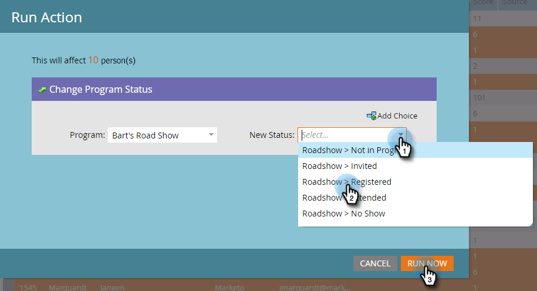

# Förbered dig för händelsen {#prepare-for-your-event}

Det finns flera saker du måste göra för att göra dig redo för evenemanget.

## Skapa en ny Marketo-roll {#create-a-new-marketo-role}

Marketo har en speciell användarroll för incheckningsappen för händelser.  [Skapa en ny Marketo-](https://docs.marketo.com/display/DOCS/Grant+User+Access+to+the+Check-in+App) roll för iPad- eller Android-användare med behörighet att komma åt mobilappen.

## Bjud in nya användare på surfplattan till händelsen {#invite-new-tablet-users-to-the-event}

[Bjud in nya surfplatteanvändare till ](https://docs.marketo.com/display/DOCS/Grant+User+Access+to+the+Check-in+App) händelsen och tilldela dem den nya rollen.

## Skapa ett nytt Marketo Event Program {#create-a-new-marketo-event-program}

[Skapa ett nytt Marketo-](/help/marketo/product-docs/demand-generation/events/understanding-events/create-a-new-event-program.md) händelseprogram som fångar upp personernas status när de går igenom olika faser och får korrekta mått på avkastningen för era marknadsföringssatsningar.

## Ange händelsedatum {#specify-the-event-dates}

Det går snabbt att ställa in dina händelsedatum.

1. Klicka på händelsen i schemat och ange start- och slutdatum och sluttid.

   

1. Dra över för att ändra **Preliminärt** till **Bekräftat**.

   

   >[!CAUTION]
   >
   >Om datumet för händelsen infaller mer än en vecka före eller efter det aktuella datumet visas inte händelsen i appen. **Tips**: Om du vill testa det anger du datumet tillfälligt inom en vecka från idag. Kom ihåg att returnera händelsen till rätt datum efter att du har testat den.

## Lägg till personer i din aktivitet {#add-people-to-your-event}

Nu när du känner till *när* är det dags att lägga till *vem*.

1. Om du redan har en lista över personer klickar du på panelen **Databas** i Min Marketto.

   

1. Välj en lista med personer och klicka på fliken **Personer**.

   

1. Välj personer för din aktivitet i listan. Använd **Ctrl** (eller **Kommando** på en Mac) om du vill klicka på flera personer, eller **Markera alla** om du vill markera alla.

   

1. Klicka på **Personåtgärder**, hovra över **Program** och välj **Ändra programstatus**.

   

1. Klicka på listrutan **Program** och välj din händelse.

   

1. Klicka på listrutan **New Status** och välj **Roadshow > Registered**. Klicka på **Kör nu**.

   

1. Ett litet fönster visar förlopp..

   

1. ...och visar när uppgiften är slutförd.

   

   De valda personerna är nu i din händelse, redo att checkas in med surfplatteappen på mässan.
