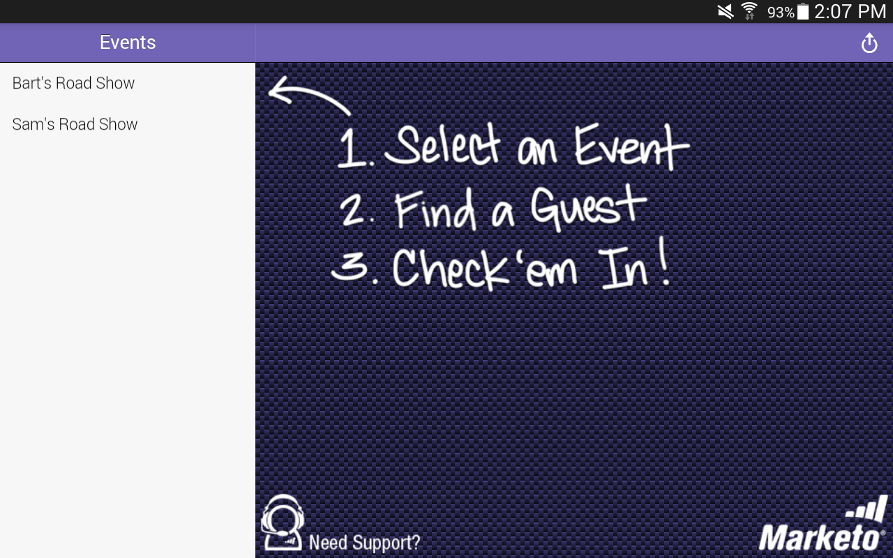

# Konfigurera iPad- eller Android-surfplattan {#set-up-the-ipad-or-android-tablet}

Om du vill ha en smidig upplevelse på en händelsedag förbereder du din iPad eller Android-surfplatta och testar appen Marketo Events före händelsen.

När du har skapat händelsen i Marketo läses den in till iPad- eller Android-appen Marketo när du loggar in, om:

* Kontot har åtkomst till din databas
* Händelsen är schemalagd för ett datum i tidsperioden som börjar en vecka före och slutar en vecka efter det aktuella datumet
* Händelsen skapades i rätt kanal (till exempel Roadshow)

>[!NOTE]
>
>Du måste vara ansluten till Internet för att hämta program.

## Hämta och installera Marketo Events iPad-appen {#download-and-install-the-marketo-events-ipad-app}

Om din iPad inte redan har Marketo Events-appen installerad gör du så här.

1. Öppna din iPad och starta App Store.

   

1. I sökrutan anger du **Marketo** och trycker på **Marketo-händelser** i Förslag.

   

1. Följ anvisningarna för att hämta och installera appen på din iPad.

## Hämta och installera Marketo Events Android-appen {#download-and-install-the-marketo-events-android-app}

Om din Android-surfplatta inte har något Marketo Events-program installerat ännu, så här skaffar du det.

1. Öppna din surfplatta och tryck på appen **Google Play Store**.
1. I sökrutan anger du **Marketo** och trycker på **Return**.
1. I sökresultaten trycker du på **Marketo Events**-appen.

   

1. Följ anvisningarna för att hämta och installera appen på din surfplatta.

## Bekräfta inloggningsuppgifter för iPad- och surfplatteanvändare {#confirm-login-credentials-for-ipad-and-tablet-users}

Innan du tilldelar iPad eller surfplattor till annan visningspersonal måste du bekräfta att inloggningsuppgifterna som de ska använda fungerar som de ska och att händelsen visas på startskärmen i appen.

1. Följ inloggningsrutinerna för iPad eller surfplatta när du loggar in.
1. Bekräfta att händelsen visas på hemskärmen. Kom ihåg att det bara visas om datumet ligger inom en vecka före och en vecka efter det aktuella datumet.

   

   >[!NOTE]
   >
   >Det kan ta flera minuter efter att en ny händelse har skapats så att den visas i iPad- eller surfplatteappen. Om den inte visas trycker du på **Logga ut** på hemskärmen, väntar några minuter och loggar sedan in igen.

## Synkronisera appen för att fylla i händelsen {#sync-the-app-to-populate-the-event}

Synkronisera för att vara säker på att de personer du har lagt till finns där.

1. Öppna din aktivitet i iPad- eller Android-appen.
1. Leta efter folk. Om du inte ser dem trycker du på **Synkronisera** för att synkronisera appen och läsa in listan med händelser igen.

   **iPad**

   

   **Android**

   

## Bekräfta att incheckningar fungerar {#confirm-check-ins-are-working}

Kontrollera att incheckningar fungerar från iPad eller surfplatta före händelsen.

1. I appen [kontrollerar du en testlead i](/help/marketo/product-docs/core-marketo-concepts/mobile-apps/event-check-in/check-people-into-your-event-from-your-tablet.md).
1. Tryck på ikonen **Synkronisera** för att synkronisera appen.
1. Öppna din händelse i Marketo och klicka på **Medlemmar**.

   

1. Bekräfta att personens status har ändrats till **Attended** och Success har kontrollerats.

   

   >[!TIP]
   >
   >Använd dig själv som testperson.
