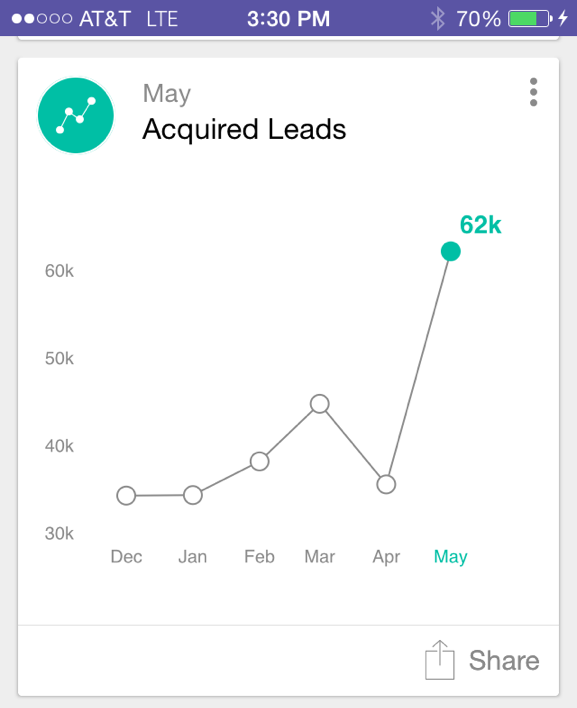

# Analyskort {#understanding-analytics-cards}

I början av varje månad tillhandahåller Marketo Moments tre olika rapportkort: Inköpta leads, Nya leads och Avbeställ prenumerationer. Var och en av dem visar månadsprestanda och trenden under en sexmånadersperiod.

>[!IMPORTANT]
>
>Den 2 oktober 2023 tog Adobe bort appen Marketo Moments från alla appbutiker. Om appen redan är installerad på din surfplatta/mobila enhet kan du fortsätta använda den tills vidare. När din Marketo Engage-instans har migrerats till Adobe Identity för autentisering av Marketo, kommer du inte längre att kunna komma åt appen. [Läs mer](https://nation.marketo.com/t5/product-discussions/marketo-events-app-and-marketo-moments-app-end-of-life/m-p/340712/highlight/true#M193869){target="_blank"}.

## Analyskort {#analytics-cards}

När du trycker på ett analyskort kan du:

* [Gör det till en favorit](/help/marketo/product-docs/core-marketo-concepts/mobile-apps/marketo-moments/working-with-moments/creating-a-favorite.md)
* [Markera som slutförd](/help/marketo/product-docs/core-marketo-concepts/mobile-apps/marketo-moments/working-with-moments/marking-it-done.md)
* [Dela](/help/marketo/product-docs/core-marketo-concepts/mobile-apps/marketo-moments/working-with-moments/sharing-a-moment.md)

Tryck på ett analyskort för att visa:

* Ett diagram över de senaste sex månadernas resultat
* En månadsjämförelse
* Ett stapeldiagram över de tre viktigaste (beroende på kortet)

Låt oss till exempel titta på informationen för kortet för analys av förvärvade leads:

I det här exemplet visar rött att värdet har minskat över det valda datumintervallet (eh!). Grönt anger att värdet har ökat (åå!).

## Förvärvade leads {#acquired-leads}

Kortet **Inhämtade leads** visar en trendrapport som visar antalet nya leads per månad.

>[!NOTE]
>
>Endast leads med ett definierat förvärvsprogram visas.

## Nya leads {#new-leads}

Kortet **[!UICONTROL New Leads]** visar en trendrapport som visar antalet nya leads i din instans under de senaste sex månaderna.

## Avbeställ {#unsubscribes}

På kortet **[!UICONTROL Unsubscribes]** visas en månadsvis trendrapport över din uppsägningsfrekvens under de senaste sex månaderna.

>[!MORELIKETHIS]
>
>* [Förstå Marketo-stunder](/help/marketo/product-docs/core-marketo-concepts/mobile-apps/marketo-moments/understanding-moments/understanding-marketo-moments.md)
>* [Om händelsekort](/help/marketo/product-docs/core-marketo-concepts/mobile-apps/marketo-moments/understanding-moments/understanding-event-cards.md)
>* [Om e-postprogramkort](/help/marketo/product-docs/core-marketo-concepts/mobile-apps/marketo-moments/understanding-moments/understanding-email-program-cards.md)
