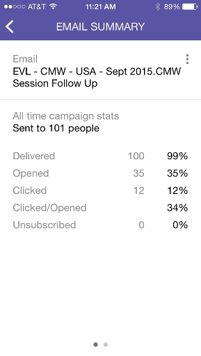

# Förstå smarta kampanjkort {#understanding-smart-campaign-cards}

Använd Marketo Moments för att visa varje körning av smarta kampanjer från smarttelefonen eller iPad. Marketo Moments smarta kampanjkort representerar en enda kampanjserie. ett nytt kort visas varje gång den smarta kampanjen körs. Smarta kampanjkort är märkta med en glödlampa längst upp till vänster.

För framtida smarta kampanjer som är schemalagda men ännu inte har körts visas ingen kampanjstatistik på Marketo Moments-kortet. De visas i en framtida release.

## Smarta kampanjkort {#smart-campaign-cards}

1. Tryck på kortet för att öppna informationskortet.

   

1. På informationskortet får du tillgång till information om Smart List-filter, flöde och e-postsammanfattning.
1. Tryck på **Smart List**.

   

1. De filter som används av den smarta listan visas här.

   

1. Tryck på **Flöde**.

   

1. Nu ska vi se hur smart Campaign fungerar. Den här kampanjen har bara ett flödessteg, men det kan finnas flera.

   

1. Klicka på **E-postsammanfattning**.

   

1. Nu kan du se mottagarnas svar på varje e-postmeddelande, per nummer och procent.

   

1. Ser du de där två punkterna längst ned? De visar att det finns två e-postmeddelanden kopplade till den här smarta kampanjen. Om du vill visa resultat för den andra e-postadressen drar du skärmen åt vänster. Här är resultaten för det andra e-postmeddelandet.

   

   >[!NOTE]
   >
   >Observera att den andra punkten är markerad nu.

## Skapa e-postexempel och förhandsvisningar {#creating-email-samples-and-previews}

Det är en bra idé att ta en titt på ett e-postmeddelande innan det skickas ut. Eller skicka ett prov till någon annan för att få en andra uppsättning ögon på det.

1. Tryck på åtgärdsmenyn med tre punkter i ett e-postmeddelande.

   

1. Tryck på [Skicka exempel](../../../../../product-docs/core-marketo-concepts/mobile-apps/marketo-moments/working-with-moments/sending-a-sample.md) eller [Förhandsgranska e-post](../../../../../product-docs/core-marketo-concepts/mobile-apps/marketo-moments/working-with-moments/previewing-an-email.md) (klicka på länkarna för mer information).

   

## Bekräfta en körning av en smart kampanj {#confirming-a-smart-campaign-run}

Kort för obekräftade smarta kampanjer är grå tills du bekräftar dem. Sedan blir de orange.

1. Bekräfta ett obekräftat smart kampanjkort genom att trycka på åtgärdsmenyn med tre punkter.

   

1. Tryck på **Bekräfta**.

   

1. Tryck på **Bekräfta** för att slutföra jobbet eller **Slut aldrig** bort om du har andra tankar.

   

   >[!NOTE]
   >
   >Nu förvandlas kortet till orange!

## Avbryta en körning av en smart kampanj {#canceling-a-smart-campaign-run}

Du kan avbryta en bekräftad, schemalagd smart kampanjkörning.

1. Tryck på åtgärdsmenyn för tre punkter.

   

1. Tryck på **Avbryt körning**.

   

1. Tryck på **Avbryt körning**. Om du i sista minuten bestämmer dig för att inte avbryta körningen trycker du på **Aldrig Mind**, så körs den smarta kampanjen som planerat.

   

## Schemalägga om en smart kampanj {#rescheduling-a-smart-campaign}

Du kan schemalägga om en bekräftad smart kampanj som inte har körts än.

1. Tryck på åtgärdsmenyn för tre punkter.

   

1. Tryck på **Ändra schema**.

   

1. Välj ett datum i kalendern och tryck på **Ändra schema**.

   

   Kakbit!

## Andra smarta kampanjåtgärder {#other-smart-campaign-actions}

Precis som med andra Marketo Moments-kort kan du trycka på de tre punkterna på ett Smart Campaign-kort eller informationskort för att:

* [Gör det till en favorit](../../../../../product-docs/core-marketo-concepts/mobile-apps/marketo-moments/working-with-moments/creating-a-favorite.md)
* [Markera som klar](../../../../../product-docs/core-marketo-concepts/mobile-apps/marketo-moments/working-with-moments/marking-it-done.md)
* [Dela](../../../../../product-docs/core-marketo-concepts/mobile-apps/marketo-moments/working-with-moments/sharing-a-moment.md)

>[!NOTE]
>
>Du kan också trycka på ikonen **Dela** på ett Smart Campaign-kort som du vill dela och ikonerna **Klar** och **Favorit** på informationskortet.

## Ta snabbt bort ett Smart Campaign-kort {#quickly-delete-a-smart-campaign-card}

Om du har ett kort som du inte längre behöver, kanske ett som du använde för att testa, kan du ta bort det med en snabb svepning åt vänster eller höger.
