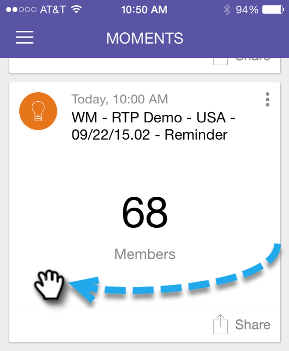

# Markera färdig {#marking-it-done}

Markera ett e-postprogram, en händelse eller ett analyskort som Klar för att ta bort det från strömmen. Det finns två sätt att göra det på.

1. Tryck på åtgärdsmenyn.

   

1. Tryck på **Klar**.

   

1. Eller svep kortet åt vilket håll som helst.

   

   >[!NOTE]
   >
   >Om du markerar ett kort som Klar tas inte e-post, händelse eller smart kampanj bort. Det flyttar det bara från strömmen Moment/Senare till strömmen Done.

Kakbit!