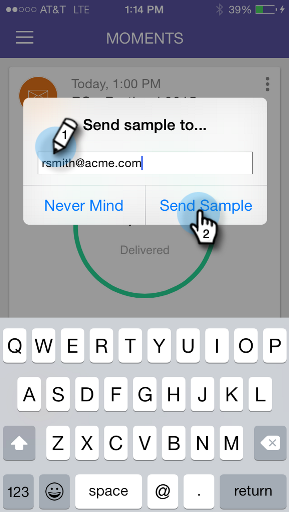

# Skicka ett exempel {#sending-a-sample}

Du kan dela ett exempel på en e-poststund direkt med någon. Det finns två sätt att göra det på.

## Det normala sättet {#the-regular-way}

1. Öppna kortmenyn.

   

1. Tryck **Skicka exempel**.

   

1. Ange en e-postadress och klicka på **Skicka exempel**.

   

## Snabbvägen {#the-quick-way}

1. Tryck på ikonen för pappersflygplanet på skärmen E-postförhandsgranskning för att skicka ett exempel direkt från förhandsgranskningen.

   

Uppdraget är slutfört!
