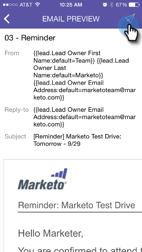

# Skicka ett exempel {#sending-a-sample}

Du kan dela ett exempel på en e-poststund direkt med någon. Det finns två sätt att göra det på.

>[!IMPORTANT]
>
>Den 2 oktober 2023 tog Adobe bort appen Marketo Moments från alla appbutiker. Om appen redan är installerad på din surfplatta/mobila enhet kan du fortsätta använda den tills vidare. När din Marketo Engage-instans har migrerats till Adobe Identity för autentisering av Marketo kan du inte längre komma åt appen. [Läs mer](https://nation.marketo.com/t5/product-discussions/marketo-events-app-and-marketo-moments-app-end-of-life/m-p/340712/highlight/true#M193869){target="_blank"}.

## Det normala sättet {#the-regular-way}

1. Öppna kortmenyn.

   

1. Tryck på **[!UICONTROL Send Sample]**.

   

1. Ange en e-postadress och klicka på **[!UICONTROL Send Sample]**.

   

## Snabbvägen {#the-quick-way}

1. Tryck på ikonen för pappersflygplanet på skärmen [!UICONTROL Email Preview] för att skicka ett exempel direkt från förhandsgranskningen.

   
