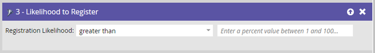
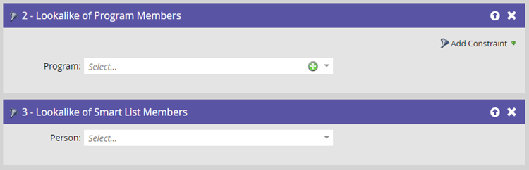

# Prediktiva filter {#predictive-filters}

Som en del av Predictive Audiences erbjuder Marketo en grupp AI/ML-baserade filter i smarta listor.

>[!NOTE]
>
>Filtren&quot;Sannolikt att delta&quot; och&quot;Sannolikt att registrera&quot; kan bara användas i händelse- eller e-postprogram. &quot;Sannolikhet för att säga upp prenumerationen&quot;, &quot;Lookalike of Program Members&quot; och &quot;Lookalike of Smart List Members&quot; kan användas i alla programtyper.

## Sannolikhet att delta

Det här filtret används för att effektivt begränsa er målgrupp. Detta hjälper er att rikta in och bjuda in leads som har större sannolikhet att **deltar** ditt webbinarium eller event. Observera att&quot;Sannolikhet att delta&quot; kommer att vara ditt nuvarande eventprogram.

## Sannolikhet för registrering

Liknar _Sannolikhet att delta_ filtrera, använd det här filtret för att begränsa målgrupper och målleads som har större sannolikhet att **registrering** för webbinariet eller evenemanget.

## Sannolikhet för avbeställning

Detta filtrerar publiken efter om de har en hög eller låg sannolikhet för att sluta prenumerera under de kommande två veckorna. Du kan använda detta för att rikta in dig på utmattning på olika sätt och mer effektivt. Tröskelvärdet för att avbryta prenumerationen är dynamiskt och styrs av en AI-modell som tar hänsyn till flera attribut, inklusive ledtid i databasen och lead-aktiviteter.

>[!NOTE]
>
>Sannolikheten för att delta/registrera/avbryta prenumeration-filter måste användas tillsammans med andra standardfilter.

## Lookalike of Program Members/Lookalike of Smart List Members

Dessa två filter hjälper er att utöka er nuvarande målgrupp genom att rikta in er på fler leads som liknar medlemmar i andra program eller Smart List. Filtren Lookalike tar hänsyn till fler än 50 faktorer, inklusive leadattribut, e-postaktivitet, webbaktivitet och engagemang.

Klicka **[!UICONTROL Add Constraint]** om du vill välja villkor för att medlemmarna i de valda programmen ska lyckas.

Klicka på **+** om du enkelt vill lägga till flera program/smarta listor till ett filter.

