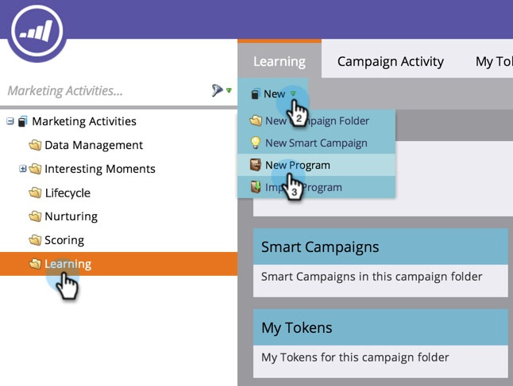

# Skapa ett program {#create-a-program}

Program är ett av de viktigaste elementen i Marketo. Du kommer att använda dem mycket!

1. Gå till **Marknadsföringsaktiviteter.**

   

1. Välj mapp för det nya programmet. Välj **Nytt** och klicka **Nytt program**.

   

1. Ange **Namn** väljer du en **[Kanal](https://docs.marketo.com/display/DOCS/Create+a+Program+Channel)** i listrutan och klicka på **Skapa**.

   

>[!MORELIKETHIS]
>
>[Förstå program](/help/marketo/product-docs/core-marketo-concepts/programs/creating-programs/understanding-programs.md).
