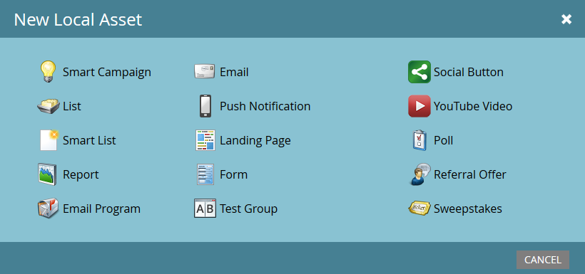

# Förstå lokala resurser i ett program {#understanding-local-assets-in-a-program}

Lokala resurser är det innehåll som utgör programmet. Resurserna är anpassningsbara och gör att ni kan skapa automatiserade marknadsföringsinitiativ. Här är en översikt över de flesta lokala resurser du kan skapa i ett program:

>[!NOTE]
>
>Alla kunder har inte tillgång till alla tillgängliga mediefiler. Kontakta din kontorepresentant om du vill veta mer.

* [Smarta kampanjer](/help/marketo/product-docs/core-marketo-concepts/smart-campaigns/creating-a-smart-campaign/understanding-batch-and-trigger-smart-campaigns.md)
* [Listor](/help/marketo/product-docs/core-marketo-concepts/smart-lists-and-static-lists/static-lists/understanding-static-lists.md)
* [Smarta listor](/help/marketo/product-docs/core-marketo-concepts/smart-lists-and-static-lists/creating-a-smart-list/create-a-smart-list.md)
* [Rapport](/help/marketo/product-docs/reporting/basic-reporting/report-types/report-type-overview.md)
* [E-postprogram](/help/marketo/product-docs/email-marketing/email-programs/creating-an-email-program/understanding-email-programs.md)
* [E-post](/help/marketo/product-docs/email-marketing/email-programs/email-program-actions/create-an-email-for-an-email-program.md)
* [Push-meddelanden](/help/marketo/product-docs/mobile-marketing/push-notifications/understanding-push-notifications.md)
* [Landningssida](/help/marketo/product-docs/demand-generation/landing-pages/understanding-landing-pages/understanding-free-form-vs-guided-landing-pages.md)
* [Forms](/help/marketo/product-docs/demand-generation/forms/creating-a-form/create-a-form.md)
* [Testgrupp](/help/marketo/product-docs/demand-generation/landing-pages/understanding-landing-pages/landing-page-test-groups.md)
* [Knappen Socialt](/help/marketo/product-docs/demand-generation/landing-pages/free-form-landing-pages/add-a-social-button-to-a-free-form-landing-page.md)
* [YouTube-video](/help/marketo/product-docs/demand-generation/social/social-functions/add-a-video.md)
* [Omröstning](/help/marketo/product-docs/demand-generation/social/creating-a-poll/create-a-poll.md)
* [Referenserbjudande](/help/marketo/product-docs/demand-generation/social/referral-offers/create-a-referral-offer.md)
* [Lotteriet](/help/marketo/product-docs/demand-generation/social/sweepstakes/create-sweepstakes.md)
* [Vibes SMS Messages](/help/marketo/product-docs/mobile-marketing/vibes-sms-messages/create-a-vibes-sms-message.md)
