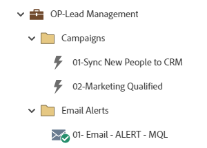

# OP-Lead Management {#op-lead-management}

Det här är ett exempel på arbetsflöden för bästa praxis för leadhantering, med ett Marketo Engage-standardprogram, som hjälper dig att hantera poster i din Marketo Engage-databas till din CRM.

>[!NOTE]
>
>I Marketo Engage kallas poster i din databas personer/person. Leadhanteringen i det här exemplet gäller posterna i CRM.

Om du vill ha mer strategihjälp eller hjälp med att anpassa ett program kontaktar du kontogruppen på Adobe eller går till sidan [Adobe Professional Services](https://business.adobe.com/customers/consulting-services/main.html) .

## Kanalsammanfattning {#channel-summary}

<table style="table-layout:auto"> 
 <tbody> 
  <tr> 
   <th>Kanal</th> 
   <th>Status för medlemskap</th>
   <th>Analysbeteende</th>
   <th>Programtyp</th>
  </tr> 
  <tr> 
   <td>Operativ</td> 
   <td>01-medlem</td>
   <td>Operativ</td>
   <td>Standard</td>
  </tr>
 </tbody> 
</table>

## Programmet innehåller följande Assets {#program-contains-the-following-assets}

<table style="table-layout:auto"> 
 <tbody> 
  <tr> 
   <th>Typ</th> 
   <th>Mallnamn</th>
   <th>Resursnamn</th>
  </tr> 
  <tr> 
   <td>Smart Campaign</td> 
   <td> </td>
   <td>01 - Synkronisera nya personer till CRM</td>
  </tr>
  <tr> 
   <td>Smart Campaign</td> 
   <td> </td>
   <td>02 - Kvalificerad marknadsföring</td>
  </tr>
  <tr> 
   <td>E-post</td> 
   <td><a href="/help/marketo/product-docs/core-marketo-concepts/programs/program-library/quick-start-email-template.md" target="_blank">E-postmall för snabbstart</a></td>
   <td>01 - E-post - VARNING - MQL</td>
  </tr>
  <tr> 
   <td>Mapp</td> 
   <td> </td>
   <td>Kampanjer</td>
  </tr>
  <tr> 
   <td>Mapp</td> 
   <td> </td>
   <td>E-postavisering</td>
  </tr>
 </tbody> 
</table>

## Konfliktregler {#conflict-rules}

* **Programtaggar**
   * Skapa taggar i den här prenumerationen - _Rekommenderas_
   * Ignorera

* **Landningssidmall med samma namn**
   * Kopiera ursprunglig mall - _Rekommenderad_
   * Använd målmall

* **Bilder med samma namn**
   * Behåll båda filerna - _Rekommenderas_
   * Ersätt artikel i den här prenumerationen

* **E-postmallar med samma namn**
   * Behåll båda mallarna - _Rekommenderas_
   * Ersätt befintlig mall

## Bästa praxis {#best-practices}

* Överväg att lägga till ytterligare smarta kampanjer för att hantera alla livscykelstatusbehov som ni kanske håller på att spåra i organisationen. Varje kampanj som byggs i det här programmet ska vara ett exempel på hur man bygger bästa praxis och inte specifik för alla användningsfall. Kom ihåg att uppdatera smarta kampanjer för att hantera era specifika livscykelhanteringsprocesser.

* Överväg att uppdatera namnkonventionen för det här programexemplet så att den överensstämmer med din.
