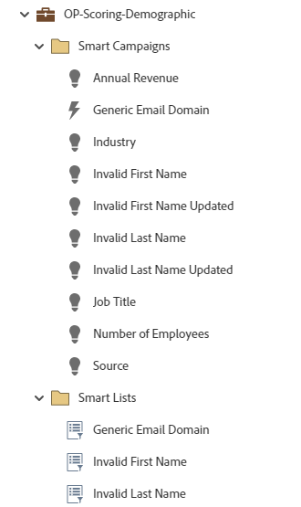

# OP-Scoring-Demographic {#op-scoring-demographic}

Detta är ett exempel på ett avancerat (tokeniserat) operativt program som använder ett Marketo Engage-standardprogram för demografiska poängbedömningar. Visa och redigera poängvärdena på fliken Mina token. Kräver ett anpassat poängfält med namnet&quot;Demografisk poäng&quot;.

Om du vill ha mer hjälp eller hjälp med att anpassa ett program kontaktar du kontogruppen på Adobe eller går till [Adobe Professional Services](https://business.adobe.com/customers/consulting-services/main.html){target="_blank"} sida.

## Kanalsammanfattning {#channel-summary}

<table style="table-layout:auto"> 
 <tbody> 
  <tr> 
   <th>Kanal</th> 
   <th>Status för medlemskap</th>
   <th>Analysbeteende</th>
   <th>Programtyp</th>
  </tr> 
  <tr> 
   <td>Operativ</td> 
   <td>01 - Medlem</td>
   <td>Operativ</td>
   <td>Standard</td>
  </tr>
 </tbody> 
</table>

## Obligatoriska fält {#prerequisite-fields}

<table style="table-layout:auto"> 
 <tbody> 
  <tr> 
   <th>Typ</th> 
   <th>Eget namn</th>
   <th>API Name</th>
  </tr>
  <tr> 
   <td>Poäng</td> 
   <td>Demografisk poäng</td>
   <td>DemographicScore</td>
  </tr>
 </tbody> 
</table>

## Programmet innehåller följande resurser {#program-contains-the-following-assets}

<table style="table-layout:auto"> 
 <tbody> 
  <tr> 
   <th>Typ</th> 
   <th>Mallnamn</th>
   <th>Resursnamn</th>
  </tr>
  <tr> 
   <td>Smart Campaign</td> 
   <td> </td>
   <td>Allmän e-postdomän</td>
  </tr>
  <tr> 
   <td>Smart Campaign</td> 
   <td> </td>
   <td>Ogiltigt förnamn</td>
  </tr>
  <tr> 
   <td>Smart Campaign</td> 
   <td> </td>
   <td>Ogiltigt förnamn uppdaterat</td>
  </tr>
  <tr> 
   <td>Smart Campaign</td> 
   <td> </td>
   <td>Ogiltigt efternamn</td>
  </tr>
  <tr> 
   <td>Smart Campaign</td> 
   <td> </td>
   <td>Ogiltigt efternamn uppdaterat</td>
  </tr>
  <tr> 
   <td>Smart Campaign</td> 
   <td> </td>
   <td>Årlig intäkt</td>
  </tr>
  <tr> 
   <td>Smart Campaign</td> 
   <td> </td>
   <td>Bransch</td>
  </tr>
  <tr> 
   <td>Smart Campaign</td> 
   <td> </td>
   <td>Befattning</td>
  </tr>
  <tr> 
   <td>Smart Campaign</td> 
   <td> </td>
   <td>Antal anställda</td>
  </tr>
  <tr> 
   <td>Smart Campaign</td> 
   <td> </td>
   <td>Källa</td>
  </tr>
  <tr> 
   <td>Mapp</td> 
   <td> </td>
   <td>Allmän e-postdomän</td>
  </tr>
  <tr> 
   <td>Mapp</td> 
   <td> </td>
   <td>Ogiltigt förnamn</td>
  </tr>
  <tr> 
   <td>Mapp</td> 
   <td> </td>
   <td>Ogiltigt efternamn</td>
  </tr>
 </tbody> 
</table>

## Mina token inkluderade {#my-tokens-included}

<table style="table-layout:auto"> 
 <tbody> 
  <tr> 
   <th>Tokentyp</th> 
   <th>Tokennamn</th>
   <th>Värde</th>
  </tr>
  <tr> 
   <td>Poäng</td> 
   <td><code>{{my.Annual Revenue - High}}</code></td>
   <td>+15</td>
  </tr>
  <tr> 
   <td>Poäng</td> 
   <td><code>{{my.Annual Revenue - Low}}</code></td>
   <td>+5</td>
  </tr>
  <tr> 
   <td>Poäng</td> 
   <td><code>{{my.Annual Revenue - Mid}}</code></td>
   <td>+10</td>
  </tr>
   <tr> 
   <td>Poäng</td> 
   <td><code>{{my.Generic Email Domain}}</code></td>
   <td>-2</td>
  </tr>
  <tr> 
   <td>Poäng</td> 
   <td><code>{{my.Industry - High}}</code></td>
   <td>+10</td>
  </tr>
  <tr> 
   <td>Poäng</td> 
   <td><code>{{my.Industry - Low}}</code></td>
   <td>+6</td>
  </tr>
   <tr> 
   <td>Poäng</td> 
   <td><code>{{my.Industry - Mid}}</code></td>
   <td>+8</td>
  </tr>
  <tr> 
   <td>Poäng</td> 
   <td><code>{{my.Invalid First Name}}</code></td>
   <td>-5</td>
  </tr>
   <tr> 
   <td>Poäng</td> 
   <td><code>{{my.Invalid First Name Updated}}</code></td>
   <td>+5</td>
  </tr>
  <tr> 
   <td>Poäng</td> 
   <td><code>{{my.Invalid Last Name}}</code></td>
   <td>-5</td>
  </tr>
  <tr> 
   <td>Poäng</td> 
   <td><code>{{my.Invalid Last Name Updated}}</code></td>
   <td>+5</td>
  </tr>
  <tr> 
   <td>Poäng</td> 
   <td><code>{{my.Job Title - High}}</code></td>
   <td>+15</td>
  </tr>
   <tr> 
   <td>Poäng</td> 
   <td><code>{{my.Job Title - Low}}</code></td>
   <td>+5</td>
  </tr>
  <tr> 
   <td>Poäng</td> 
   <td><code>{{my.Job Title - Mid}}</code></td>
   <td>+10</td>
  </tr>
  <tr> 
   <td>Poäng</td> 
   <td><code>{{my.Lead Source - High}}</code></td>
   <td>+20</td>
  </tr>
  <tr> 
   <td>Poäng</td> 
   <td><code>{{my.Lead Source - Low}}</code></td>
   <td>+8</td>
  </tr>
  <tr> 
   <td>Poäng</td> 
   <td><code>{{my.Lead Source - Mid}}</code></td>
   <td>+10</td>
  </tr>
  <tr> 
   <td>Poäng</td> 
   <td><code>{{my.Number of Employees}}</code></td>
   <td>+5</td>
  </tr>
 </tbody> 
</table>

## Konfliktregler {#conflict-rules}

* **Programtaggar**
   * Skapa taggar i den här prenumerationen - _Rekommenderas_
   * Ignorera

* **Landningssidmall med samma namn**
   * Kopiera ursprunglig mall - _Rekommenderas_
   * Använd målmall

* **Bilder med samma namn**
   * Behåll båda filerna - _Rekommenderas_
   * Ersätt artikel i den här prenumerationen

* **E-postmallar med samma namn**
   * Behåll båda mallarna - _Rekommenderas_
   * Ersätt befintlig mall

## Bästa praxis {#best-practices}

* Varje kampanj som byggs är tänkt att vara ett exempel på hur ni bygger bästa praxis och inte specifikt för era användningsfall. Kom ihåg att uppdatera smarta kampanjer för att hantera era specifika utmaningar och datamängder.

* Överväg att uppdatera namnkonventionen för det här programexemplet så att den överensstämmer med namnkonventionen.
