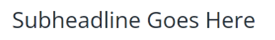

# E-postmall för snabbstart {#quick-start-email-template}

Vissa av startprogrammen i referensbiblioteket för Marketo Engage innehåller en enkel, lättanvänd och anpassningsbar e-postmall som gör det möjligt att snabbt skapa e-postmeddelanden för ett antal olika användningsområden.

E-postredigeraren i Marketo Engage har funktioner som hjälper dig att ändra layouten och redigera innehållet i dina e-postmeddelanden.

* **Moduler**: Innehållsblock som kan dras/släppas och som är kodade i mallen. De kan ordnas om och dupliceras.

* **Textelement**: Du kan använda redigeraren för att uppdatera text, ändra teckensnittsformat eller lägga till länkar.

* **Bildelement**: På samma sätt som textelement kan bilder bytas ut, länkas till och storleksändras.

* **Variabel**: När en modul är markerad visas variabler till höger om redigeraren. De kan användas för att justera attribut i modulen som inte är så lätt att redigera via bild- eller textelement.

Om du vill ha mer hjälp eller hjälp med att anpassa ett program kontaktar du kontogruppen på Adobe eller går till [Adobe Professional Services](https://business.adobe.com/customers/consulting-services/main.html){target="_blank"} sida.

## Modulsammanfattning {#modules-summary}

### Logotypmodul {#logo-module}

* Innehåller ett bildelement som uppdaterar logotypen
* Inkluderar variabler som ska kontrolleras:
   * Modulens övre utfyllnad
   * Modulens nedre utfyllnad
   * Bakgrundsfärg i modul
   * Logotypens justering
* 

### Bildmodul {#image-module}

* Innehåller ett bildelement som uppdaterar bilden
* Inkluderar variabler som ska kontrolleras:
   * Modulens övre utfyllnad
   * Modulens nedre utfyllnad
   * Bakgrundsfärg i modul
* 

### Headline Module {#headline-module}

* Innehåller ett textelement som uppdaterar rubriken
* Inkluderar variabler som ska kontrolleras:
   * Modulens övre utfyllnad
   * Modulens nedre utfyllnad
   * Bakgrundsfärg i modul
   * Teckensnittsstorlek för rubriken (kan även redigeras i RTF-redigeraren)
   * Teckenfärg för rubriken (kan även redigeras i textredigeraren)
   * Justering av rubriktexten (kan även redigeras i RTF-redigeraren)
* 

### Subheadline Module {#subheadline-module}

* Innehåller ett textelement som uppdaterar underrubriken
* Inkluderar variabler som ska kontrolleras:
   * Modulens övre utfyllnad
   * Modulens nedre utfyllnad
   * Bakgrundsfärg i modul
   * Underrubrikens teckensnittsstorlek (kan även redigeras i RTF-redigeraren)
   * Teckensnittsfärg för underrubriken (kan även redigeras i RTF-redigeraren)
   * Justering av underrubriken (kan även redigeras i RTF-redigeraren)
* 

### Modul för fri text {#free-text-module}

* Innehåller ett textelement som ska uppdatera texten
* Inkluderar variabler som ska kontrolleras:
   * Modulens övre utfyllnad
   * Modulens nedre utfyllnad
   * Bakgrundsfärg i modul
   * Teckensnittsstorlek för text (kan även redigeras i RTF-redigeraren)
   * Teckenfärg för text (kan även redigeras i textredigeraren)
   * Textens justering (kan även redigeras i RTF-redigeraren)
* 

### CTA-modul {#cta-module}

* Inkluderar variabler som ska kontrolleras:
   * Modulens övre utfyllnad
   * Modulens nedre utfyllnad
   * Bakgrundsfärg i modul
   * CTA-textfärg
   * CTA-bakgrundsfärg
   * CTA-kantfärg
   * CTA-kantradie (för att göra knapparna rundade - **Anteckning**: den här funktionen fungerar inte i e-postklienter i Microsoft Outlook)
   * CTA URL
   * CTA-text
   * CTA-justering
* 

### Delningsmodul {#divider-module}

* Inkluderar variabler som ska kontrolleras:
   * Modulens övre utfyllnad
   * Modulens nedre utfyllnad
   * Bakgrundsfärg i modul
   * Delningsfärg
   * Delningshöjd (i pixlar)
   * Delningsbredd (som %)
* 

### Modul för sidfot {#footer-module}

* Textelement som kan användas för att byta ut eller länka sociala ikoner
* Textelement som uppdaterar sidfotens språk
* Inkluderar variabler som ska kontrolleras:
   * Modulens övre utfyllnad
   * Modulens nedre utfyllnad
   * Bakgrundsfärg i modul
   * Textfärg
   * Innehållsjustering
* 
