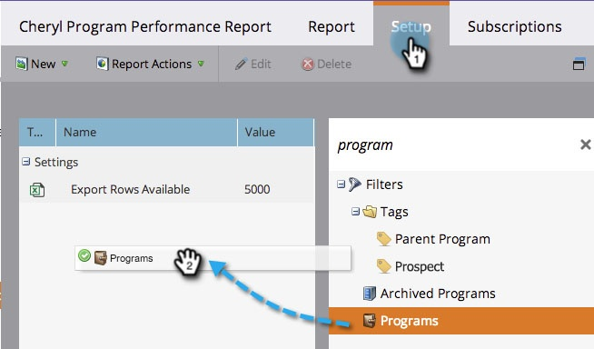

# Filtrera en programrapport per program {#filter-a-program-report-by-program}

Fokusera din [programresultatrapport](/help/marketo/product-docs/core-marketo-concepts/programs/program-performance-report/create-a-program-performance-report.md){target="_blank"} på specifika program för att jämföra deras prestanda.

1. Gå till **[!UICONTROL Marketing Activities]** (eller **[!UICONTROL Analytics]**).

   

1. Välj en rapport om programmets prestanda.

   

1. Klicka på fliken **[!UICONTROL Setup]** och dra över **[!UICONTROL Programs]**.

   

1. Välj de mappar och program som ska ingå i rapporten.

   

   >[!TIP]
   >
   >Om du väljer en mapp innehåller rapporten allt som finns i mappen när rapporten körs.

1. Det är allt! Klicka på fliken **[!UICONTROL Report]** för att visa _just_ de valda programmen i rapporten.

   

>[!NOTE]
>
>[Filtrera en programrapport efter tagg](/help/marketo/product-docs/core-marketo-concepts/programs/program-performance-report/filter-a-program-report-by-tag.md){target="_blank"}
